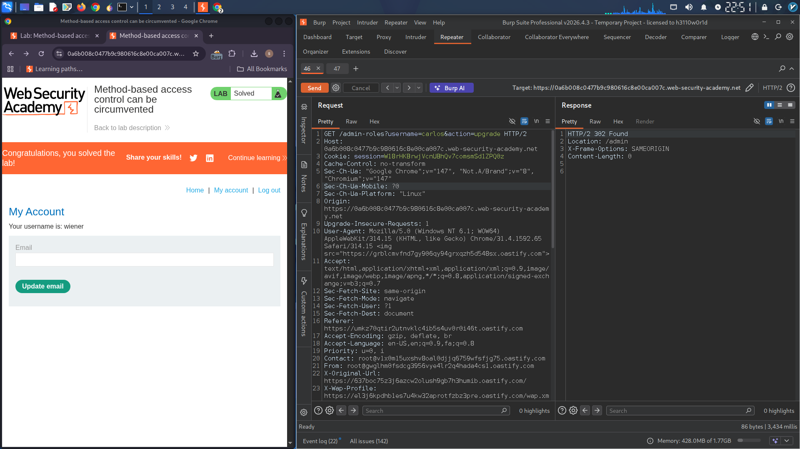

# HTTP Method-Based Access Control Bypass

## Lab: Flawed Access Controls via HTTP Method Manipulation

### Objective
Exploit flawed access controls that rely on HTTP methods to promote your non-admin account (wiener) to administrator.

### Credentials
| Username | Password |
|----------|----------|
| administrator | admin |
| wiener | peter |

### Exploitation Steps

**Step 1:** Log in as `administrator:admin` and browse to the admin panel. Promote carlos and capture the request in Burp Repeater.

**Step 2:** Open a private browser window and log in as `wiener:peter`. Copy your session cookie.

**Step 3:** In Burp Repeater, replace the administrator's session cookie with wiener's cookie and send the request. Response shows `"Unauthorized"`.

**Step 4:** Change the method from `POST` to `POSTX` (invalid method). Response changes to `"missing parameter"` — indicating method-based validation.

**Step 5:** Right-click and select **"Change request method"** to convert to `GET`.

**Original POST request:**
```
POST /admin-roles?username=carlos&action=upgrade HTTP/2
```

**Modified GET request:**
```
GET /admin-roles?username=wiener&action=upgrade HTTP/2
```

**Step 6:** Send the request with wiener's session cookie. Account is now promoted to administrator.

### Final Request
```
GET /admin-roles?username=wiener&action=upgrade HTTP/2
Host: YOUR-LAB-ID.web-security-academy.net
Cookie: session=YOUR_WIENER_SESSION_COOKIE
```

### Attack Summary

| Method | Result |
|--------|--------|
| POST (admin cookie) | Success |
| POST (wiener cookie) | Unauthorized |
| POSTX (wiener cookie) | Missing parameter |
| **GET (wiener cookie)** | **Success ✓** |


### Vulnerability
Access control only blocks POST requests but allows GET requests to perform the same privileged action.

### Remediation
- Enforce access controls regardless of HTTP method
- Use consistent authorization checks for all methods
- Require POST for state-changing actions

---

## Lab Solved ✓


