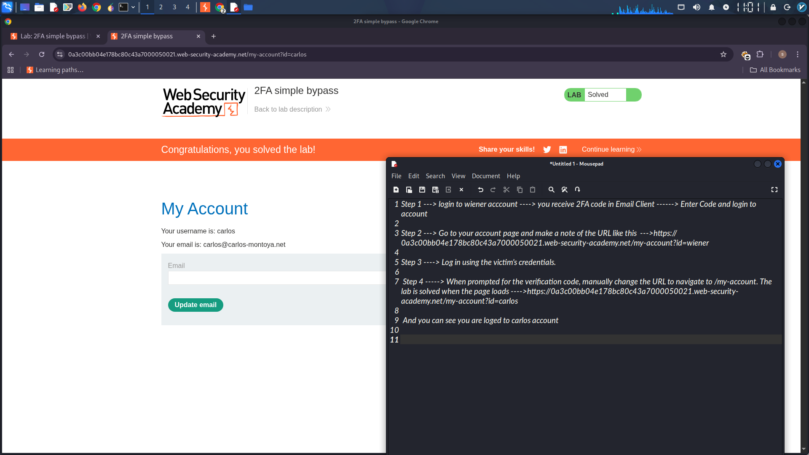

# 2FA Authentication Bypass via URL Manipulation

## Lab: Broken 2FA Logic with Direct Account Access

### Objective
Bypass the two-factor authentication (2FA) verification step by directly navigating to the account page after entering valid credentials.

### Credentials
| Username | Password |
|----------|----------|
| wiener | peter |
| carlos | (victim credentials provided) |

### Exploitation Steps

**Step 1:** Log in to the `wiener` account. Receive the 2FA code in the Email Client, enter it, and successfully log in.

**Step 2:** Go to your account page and note the URL pattern:
```
https://YOUR-LAB-ID.web-security-academy.net/my-account?id=wiener
```

**Step 3:** Log out, then log in using the victim's credentials (`carlos`).

**Step 4:** When prompted for the verification code, do not enter it. Instead, manually change the URL to navigate directly to `/my-account`:
```
https://YOUR-LAB-ID.web-security-academy.net/my-account?id=carlos
```

The page loads successfully and you are logged into carlos's account.

### Attack Summary

| Step | Action | Result |
|------|--------|--------|
| 1 | Login as wiener with 2FA | Successful |
| 2 | Observe URL pattern | `/my-account?id=username` |
| 3 | Login as carlos (credentials only) | 2FA prompt appears |
| 4 | Bypass 2FA by directly accessing `/my-account?id=carlos` | Logged in as carlos ✓ |

### Final Request
```
GET /my-account?id=carlos HTTP/2
Host: YOUR-LAB-ID.web-security-academy.net
Cookie: session=YOUR_SESSION_AFTER_LOGIN
```

### Vulnerability
After successful authentication (without 2FA code), the session is partially authenticated. The application fails to enforce 2FA verification before allowing access to the account page.

### Remediation
- Verify 2FA completion before granting access to any authenticated endpoint
- Redirect unverified sessions to the 2FA page
- Store 2FA verification status in session and check on every request

---

## Lab Solved ✓


