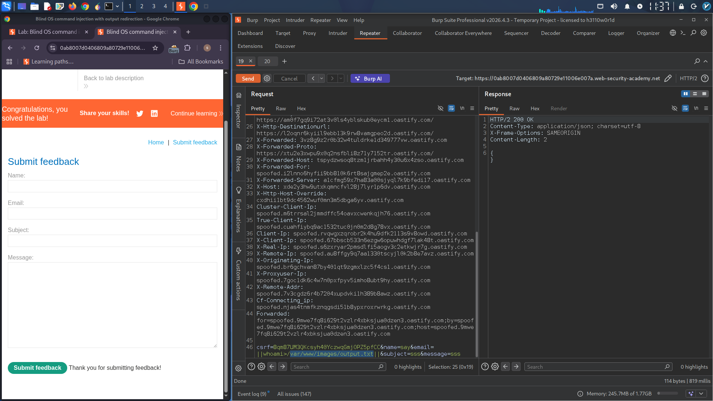
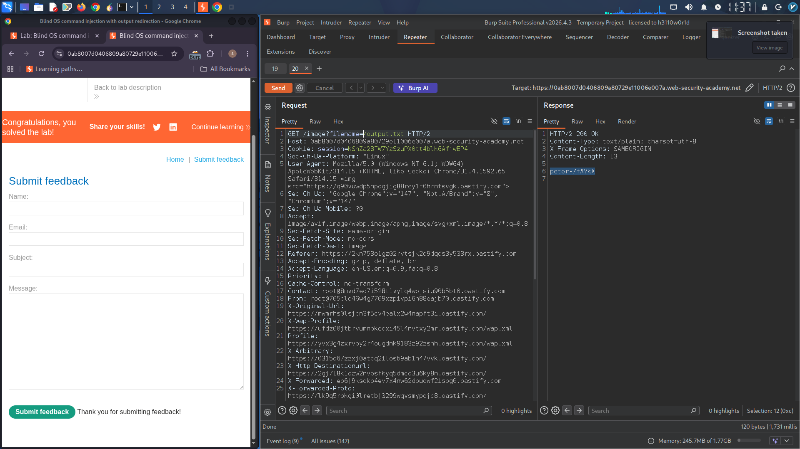

# Blind OS Command Injection - Output Redirection

## Overview
Exploited a blind OS command injection vulnerability in a web application's feedback function by redirecting command output to a publicly accessible directory, then retrieving it via the image loading endpoint.

**Target Directory:** `/var/www/images/`

## Attack Flow

### Step 1: Inject Command & Redirect Output
Intercepted the feedback submission request in Burp Suite and injected a payload into the `email` parameter to execute `whoami` and write the output to the images directory.

**Payload:**
```
email=||whoami>/var/www/images/output.txt||
```



### Step 2: Retrieve Command Output
Intercepted an image loading request and modified the `filename` parameter to retrieve the output file created in Step 1.

**Request:**
```
filename=output.txt
```



## Result
Successfully retrieved the `whoami` command output, confirming the server runs as the `www-data` user.

---

**Tools Used:** Burp Suite (Proxy & Repeater)
