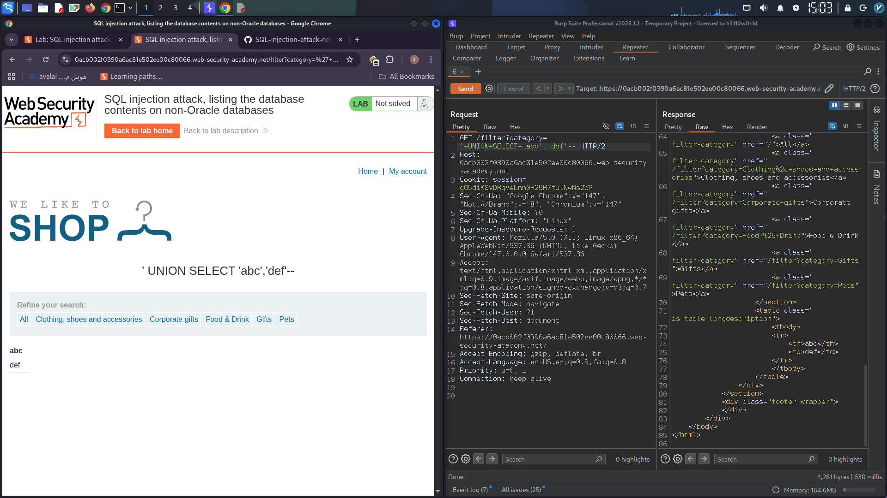
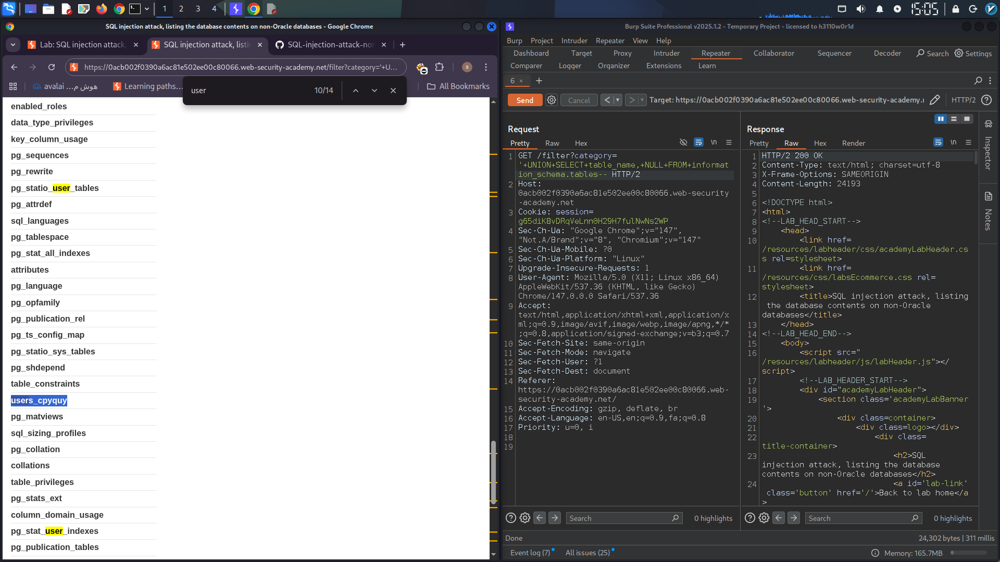
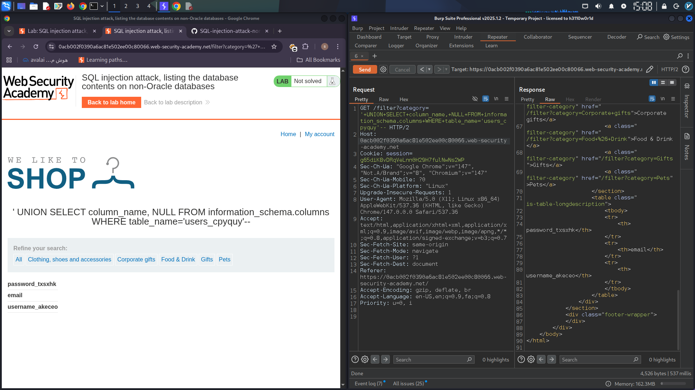
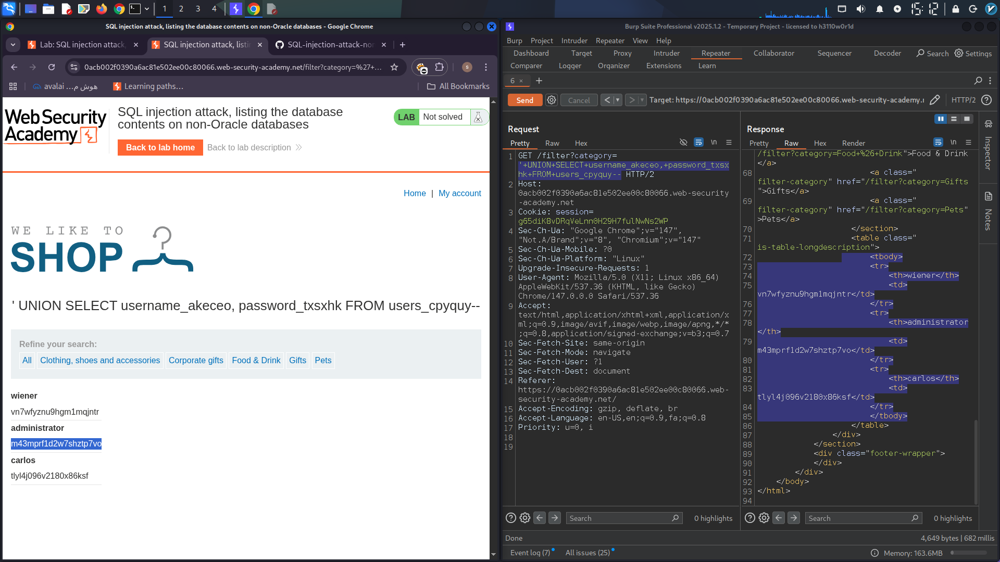
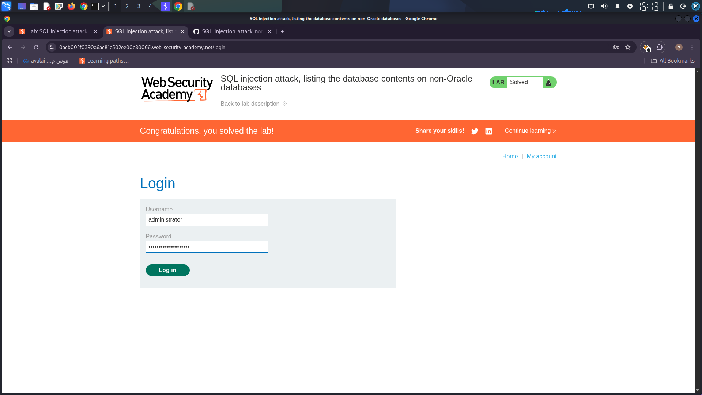

```markdown
# Comprehensive SQL Injection Report for Database Information Extraction

This report outlines a step-by-step approach to exploiting **SQL Injection** vulnerabilities to extract sensitive database information by intercepting and modifying HTTP requests using **Burp Suite**.  
All payloads are injected into the `category` parameter of the product filtering request.

---

## 1. Intercepting and Modifying the Request with Burp Suite

The first step involves intercepting the HTTP request responsible for setting the product category filter using Burp Suite.  
This request executes a SQL query on the backend to fetch products filtered by category.

---

## 2. Determining the Number of Columns and Data Types

Before extracting data, it’s crucial to identify:

- The number of columns returned by the original SQL query  
- Which columns accept text (string) data

### Sample Payload for Testing:

```sql
'+UNION+SELECT+'abc','def'--
```

This payload attempts to union the original query with a SELECT statement returning two text values (`abc` and `def`).  
If the response contains these values, it confirms:

- The original query returns **2 columns**  
- Both columns accept text data types

<!-- Insert screenshot showing 'abc' and 'def' in the response -->

  
*Figure 1: Confirmation of two text columns.*

---

## 3. Extracting the List of Tables in the Database

To explore the database schema, query the `information_schema.tables` metadata table.

### Payload Example:

```sql
'+UNION+SELECT+table_name,+NULL+FROM+information_schema.tables--
```

**Why use `NULL`?**  
`NULL` is used as a placeholder for the second column because we only need the table names (first column) and do not know the appropriate value for the second column.

<!-- Insert screenshot showing extracted table names -->

  
*Figure 2: Extracted list of database tables.*

---

## 4. Identifying the User Credentials Table

From the extracted list, identify the table likely containing user credentials, for example, `users_abcdef`.

---

## 5. Extracting Column Names from the User Table

Retrieve the column names of the identified user table using:

```sql
'+UNION+SELECT+column_name,+NULL+FROM+information_schema.columns+WHERE+table_name='users_abcdef'--
```

<!-- Insert screenshot showing column names -->

  
*Figure 3: Column names of the user credentials table.*

---

## 6. Identifying Username and Password Columns

From the column list, determine which columns store usernames and passwords, for example:

- `username_abcdef`  
- `password_abcdef`

---

## 7. Extracting Usernames and Passwords

Use the following payload to retrieve all usernames and passwords:

```sql
'+UNION+SELECT+username_abcdef,+password_abcdef+FROM+users_abcdef--
```

<!-- Insert screenshot showing extracted user credentials -->

  
*Figure 4: Extracted usernames and passwords.*

---

## 8. Obtaining Administrator Password and Logging In

Locate the administrator’s password from the extracted data and use it to authenticate into the system.

  
*Figure 5: login with usernames and password.*
---

## Summary

- This process demonstrates how **SQL Injection** vulnerabilities can be exploited to systematically extract database metadata and sensitive user information.  
- Testing the number and type of columns ensures accurate payload construction.  
- Leveraging `information_schema` tables is essential for database schema discovery.  
- Extracted credentials pose a significant security risk and can lead to unauthorized access.  
- To prevent such attacks, always use parameterized queries and validate user inputs rigorously.

---

## Tools Used

- **Burp Suite** for intercepting and modifying HTTP requests  
- Web browser for login testing using extracted credentials

---

*Prepared by: Miaad Shirvani*  
*Date: May 29, 2026*

