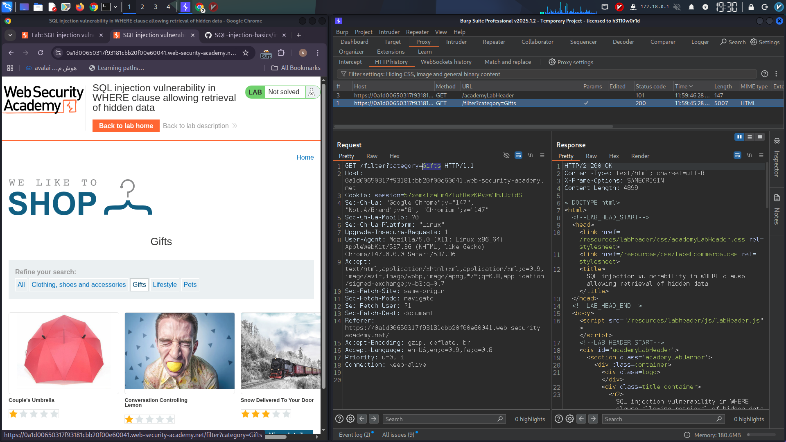
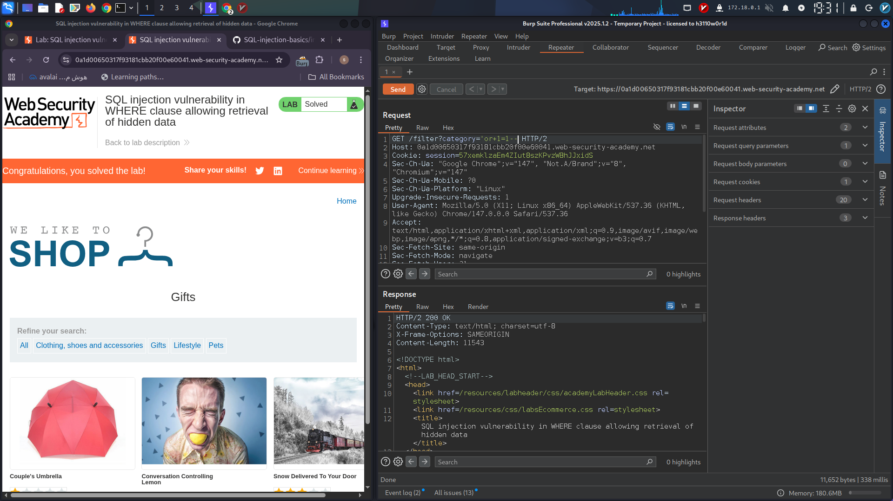

```markdown
# Simple SQL Injection Lab

A hands-on lab demonstrating a classic SQL Injection vulnerability in a product category filter.  
This project explains how improper input sanitization in the WHERE clause allows attackers to bypass filters and retrieve hidden data.

---

## Table of Contents

- [Overview](#overview)  
- [Vulnerability Description](#vulnerability-description)  
- [Step-by-Step Exploitation](#step-by-step-exploitation)  
- [Understanding the OR Operator](#understanding-the-or-operator)  
- [Important Warning](#important-warning)  
- [Tools Used](#tools-used)  
- [Topics](#topics)  
- [References](#references)  

---

## Overview

When a user selects a product category, the web application executes a SQL query similar to:

```sql
SELECT * FROM products WHERE category = 'Gifts' AND released = 1
```

This query filters products by category and release status. However, due to insufficient input validation, it is vulnerable to SQL Injection.

---

## Vulnerability Description

The application allows user input to be directly inserted into the SQL query without proper sanitization or parameterization.  
By injecting specially crafted input, an attacker can break out of the string context and manipulate the query logic.

---

## Step-by-Step Exploitation

1. **Intercept the Request:**  
   Use Burp Suite or a similar proxy tool to capture the HTTP request filtering products by category.

   <!-- Place your screenshot of the intercepted product request below -->
   
     
   *Figure 1: Intercepted HTTP request for product category filtering.*

2. **Break the Query Context:**  
   Inject a single quote (`'`) to terminate the string literal.

3. **Inject a Boolean Condition:**  
   Add an always-true condition such as `OR 1=1` to bypass the filter.

4. **Comment Out the Rest:**  
   Use `--` or `#` to comment out the remaining part of the query.

5. **Final Injection Payload Example:**  
   ```
   ' OR 1=1 --
   ```
   
   **Note on URL Encoding:**  
   When injecting payloads via URL parameters, spaces should be encoded properly. Commonly, spaces are replaced by `+` or URL-encoded as `%20`.  
   In some advanced scenarios, especially in UNIX-based systems or when the application interprets shell-like syntax, the **Internal Field Separator (IFS)** variable can be used as `{IFS}` to represent space characters.  
   For example, instead of:

   ```
   ' OR 1=1 --
   ```

   you might use:

   ```
   '+OR+1=1+--
   ```

   or

   ```
   '%27{IFS}OR{IFS}1=1{IFS}--'
   ```

   This technique can help bypass certain input filters or encoding restrictions.

6. **Effect on the Query:**  
   Original query:
   ```sql
   SELECT * FROM products WHERE category = 'Gifts' AND released = 1
   ```
   
   Modified query:
   ```sql
   SELECT * FROM products WHERE category = 'Gifts' OR 1=1 -- ' AND released = 1
   ```
   
   This returns all products, bypassing the intended filter.

   <!-- Place your screenshot of the successful payload injection and response here -->
   
     
   *Figure 2: Successful injection payload and retrieved data showing bypassed filter.*

---

## Understanding the OR Operator

The `OR` operator evaluates to `TRUE` if **at least one** operand is true.

| Operand A | Operand B | A OR B |
|-----------|-----------|--------|
| 0         | 0         | 0      |
| 0         | 1         | 1      |
| 1         | 0         | 1      |
| 1         | 1         | 1      |

Since `1=1` is always true (`1`), the entire condition becomes true, and the filter is bypassed.

---

## Important Warning

Be careful when injecting `OR 1=1` conditions.  
Applications may reuse user input in multiple queries, including `UPDATE` or `DELETE` statements.  
Improper injections can cause unintended data loss or corruption.

---

## Tools Used

- [Burp Suite](https://portswigger.net/burp) - Intercept and modify HTTP requests.
- Any web browser with developer tools.

---

## Topics

`sql-injection` `web-security` `penetration-testing` `vulnerability` `bug-bounty` `ctf` `learning`

---

## References

- [OWASP SQL Injection](https://owasp.org/www-community/attacks/SQL_Injection)  
- [SQL Injection Tutorial - PortSwigger](https://portswigger.net/web-security/sql-injection)  
- [Burp Suite Documentation](https://portswigger.net/burp/documentation)

---

Feel free to contribute or open issues if you have any questions or improvements!

---

*Author: Miaad Shirvani*  
*Date: 2026-05-28*
