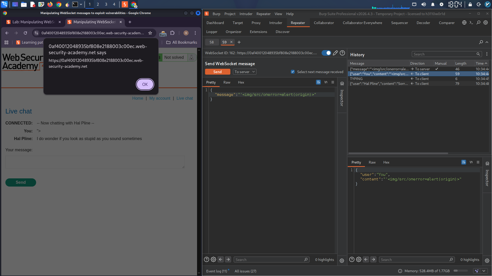

## Manipulating WebSocket messages to exploit vulnerabilities

### Objective
Exploit a WebSocket-based XSS vulnerability by sending a malicious payload through a manipulated chat message.

### Vulnerability Description
The Live chat feature uses WebSockets for real-time messaging. While the client-side JavaScript HTML-encodes special characters like `<` before sending, the server does not validate or sanitize messages. By intercepting and modifying WebSocket messages in transit, an attacker can inject arbitrary HTML/JavaScript that executes in the victim's browser (including support agents).

### Exploitation Steps

**Step 1:** Click **"Live chat"** and send a normal chat message.

**Step 2:** In Burp Proxy, go to the **WebSockets history** tab. Observe that the message was sent via WebSocket.

**Step 3:** Send a new message containing a `<` character. In the WebSocket history, observe that the client HTML-encoded it to `&lt;` before sending.

**Step 4:** Configure Burp Proxy to intercept WebSocket messages (Proxy > Intercept > Intercept WebSocket Messages).

**Step 5:** Send another chat message. When intercepted, edit the message content:

**Original intercepted message:**
```json
{"message": "Hello"}
```

**Modified payload:**
```json
{"message": ""}
```

**Step 6:** Forward the message. An alert box appears in the browser, confirming XSS. This will also execute in the support agent's browser.

### WebSocket Message Flow

```
Attacker Browser                    WebSocket Server                    Victim/Agent Browser
      │                                      │                                      │
      │─────  ──>│                                      │
      │  (intercepted & modified in Burp)    │                                      │
      │                                      │───── Broadcast malicious message ──>│
      │                                      │                                      │
      │                                      │                              alert(1) ▼
```

### Burp Repeater - WebSocket Message

Send the intercepted WebSocket message to Burp Repeater for further testing:

```
[WebSocket message to /chat]
{"message": ""}
```

### Alternative Payloads

| Payload | Effect |
|---------|--------|
| `<script>alert(1)</script>` | Classic XSS |
| `` | Image error XSS |
| `<svg onload=alert(1)>` | SVG XSS |
| `<body onload=alert('XSS')>` | Body XSS |

### Vulnerability Summary

| Component | Issue |
|-----------|-------|
| WebSocket messages | No server-side sanitization |
| Client encoding | Bypassed via interception |
| Message rendering | Rendered as HTML in victim's browser |

### Remediation

1. **Sanitize all messages server-side** before broadcasting
2. **Escape HTML entities** on the server, not just client
3. **Implement Content Security Policy (CSP)** to block inline scripts
4. **Validate message content** with a whitelist approach

### Tools Used
- Burp Suite (Proxy, WebSockets history, Repeater)
- Burp Browser

---

## Lab Solved ✓


