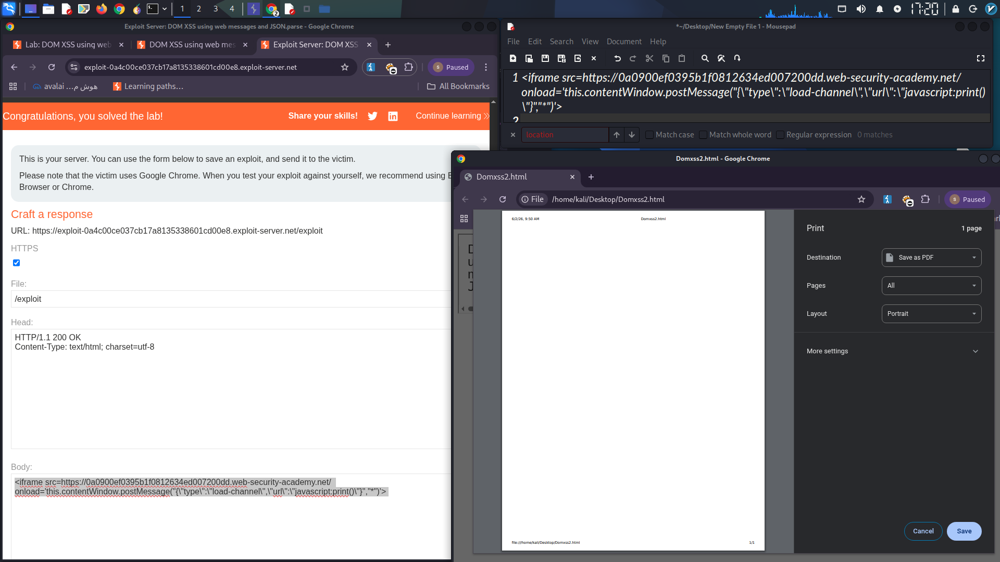

### Title: DOM-based XSS via Insecure Web Message Listener (`postMessage`)

#### 1. Vulnerability Summary

A DOM-based Cross-Site Scripting (XSS) vulnerability exists on the home page. The page uses a `postMessage` event listener to dynamically change the `src` attribute of an iframe, but it fails to verify the origin of the incoming message and does not sanitize the received `url` property. An attacker can send a malicious cross-origin message containing a `javascript:` URI, leading to arbitrary JavaScript execution in the victim's browser.

---

#### 2. Technical Analysis

**The Vulnerable Code Logic:**

The home page contains an event listener similar to this pattern:

```javascript
window.addEventListener('message', function(event) {
    var data = JSON.parse(event.data);
    
    switch(data.type) {
        case 'load-channel':
            document.getElementById('ACMEplayer').src = data.url;
            break;
    }
});
```

**Two Critical Security Failures:**

| Failure | Explanation |
|---------|-------------|
| **Missing Origin Check** | The listener processes messages from any origin (`*`). It never verifies if the message came from a trusted domain using `event.origin`. |
| **Unvalidated `src` Assignment** | The `url` property from the parsed JSON is directly assigned to an iframe's `src`. No check prevents the use of dangerous protocols like `javascript:`. |

---

#### 3. Proof of Concept

The following iframe, hosted on an attacker-controlled server, exploits the vulnerability:

```html
<iframe 
  src="https://YOUR-LAB-ID.web-security-academy.net/" 
  onload='this.contentWindow.postMessage(
    "{\"type\":\"load-channel\",\"url\":\"javascript:print()\"}",
    "*"
  )'>
</iframe>
```

**Step-by-Step Exploitation Flow:**

1.  **Victim visits attacker's page:** The victim loads the page containing the malicious iframe.
2.  **Target site loads inside iframe:** The vulnerable home page loads within the iframe.
3.  **`onload` fires:** Once the target page finishes loading, the `onload` event triggers.
4.  **Malicious message is sent:** `postMessage` sends a JSON payload with `type: "load-channel"` and `url: "javascript:print()"`. The target origin is set to `"*"` (allow all).
5.  **Listener receives message:** The vulnerable event listener receives the message. It does not check `event.origin`, so it accepts the external message.
6.  **Payload is parsed:** `JSON.parse` extracts the `url` value.
7.  **XSS Triggered:** The `switch` statement matches `load-channel` and sets the iframe's `src` to `javascript:print()`. The browser executes the injected JavaScript.

---

#### 4. Impact

- **Full XSS:** An attacker can execute arbitrary JavaScript in the context of the victim's session on the vulnerable domain.
- **Session Hijacking:** The attacker can steal cookies and session tokens.
- **Credential Phishing:** A fake login form could be injected directly into the page.

---

#### 5. Remediation

```javascript
window.addEventListener('message', function(event) {
    // 1. Validate the origin of the sender
    if (event.origin !== "https://trusted-origin.com") {
        return;
    }
    
    var data = JSON.parse(event.data);
    
    // 2. Validate the URL protocol
    if (data.type === 'load-channel') {
        var blockedProtocols = ['javascript:', 'data:', 'vbscript:'];
        var url = new URL(data.url, window.location.origin);
        
        if (blockedProtocols.includes(url.protocol)) {
            return; // Block dangerous protocols
        }
        
        document.getElementById('ACMEplayer').src = url.href;
    }
});
```
  

#### 6. Exploit Server Configuration (Visual Step)

*The image below shows the final exploit server setup used to deliver the payload.*


> **Always validate `event.origin` in `postMessage` listeners. Never trust data from `postMessage` without sanitization, and never allow `javascript:` URIs in iframe `src` attributes.**
